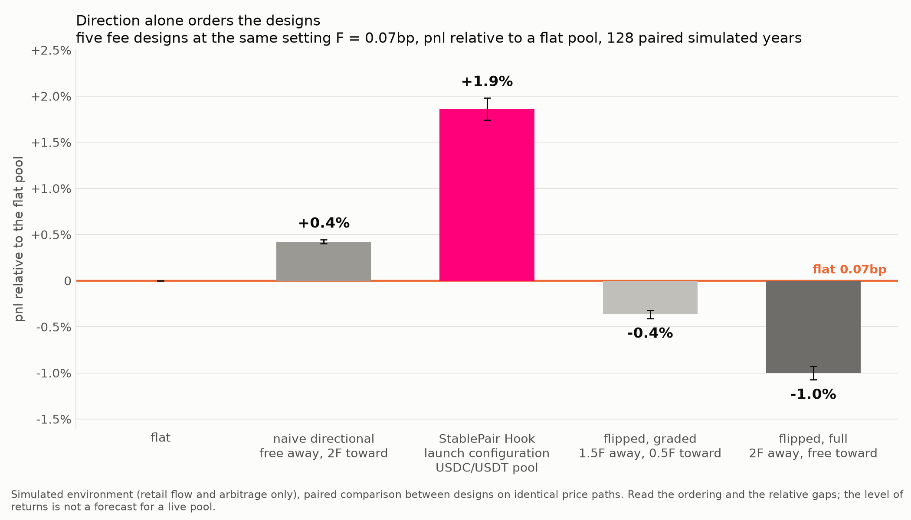

# The StablePair Hook environment

A calibrated, reproducible market environment for testing fee designs on stable
pairs, built to test the theory behind StablePair Hook against a market fitted to
data.

The theory is that for a stable pair the fair price is its reference rate: 1:1
for two tokens that represent the same asset, such as USDC and USDT or WBTC and
cbBTC. A trade that pushes the pool away from the reference trades against the
reversion. A corrective trade, one that pushes it back, captures the reversion
from the liquidity provider (LP). So the two directions of a trade are not
symmetric.

The common fee design for pegged pools raises the fee on a swap that pushes the
price away from the reference and lowers it on a swap that brings it back, to
protect the peg. For the LP that is backwards. The swap pushing the price away
is handing the pool a better-than-par price, and the swap bringing it back is
the one taking the mispricing from the pool, so the flipped design charges most
for the flow that pays LPs and least for the flow that costs them.

StablePair Hook, a Uniswap v4 dynamic-fee hook from Uniswap Labs, prices the two
directions the other way: outside of the band, corrective swaps pay a decaying
Dutch-auction fee, swaps that push the price further pay nothing, and inside a
tight band around the reference the fee moves so the quote does not. The
contract is in this repository at
[`src/stable/StablePairHook.sol`](../../../src/stable/StablePairHook.sol) and
its technical specification at
[`docs/technical/StablePairHook.md`](../../technical/StablePairHook.md). More
research pieces on the mechanism and its design reasoning are coming soon. This
folder is the market the theory was tested in.

The environment models retail flow and arbitrage only. A live pool also carries
other order flow that is not modeled here, so absolute returns will not match a
live pool's, and every result is a comparison between designs on identical
simulated markets, with paired statistics. We expect the direction result to
carry over. [methodology.md](methodology.md) defines each piece of the
environment and the reason it is built that way.

## The result

The figure compares five fee designs on the same simulated markets. All five are
set to the same fee level. What differs is how that fee is split between the two
directions of a trade.



From left to right: the flat fee, which charges both directions the same and is
the zero line; the naive directional design, which charges only the corrective
direction; StablePair Hook at its launch configuration for the USDC/USDT pool,
which charges the corrective direction with a decaying fee and adds the band
around the reference; and two flipped designs, graded and full, which charge the
away direction more than the corrective one. The flipped designs are an
abstraction of the mechanisms pegged pools on the market run today, which raise
the fee on trades that push the price off the peg.

The ordering is the one the theory predicts. Charging the corrective direction
puts a fee on the trade that takes the mispricing from the pool, so LPs keep
part of what the arbitrageur would otherwise collect, and the pool ends up above
flat. StablePair Hook sits above the naive design because its corrective fee is
sized to the mispricing at the time rather than fixed: it charges more when
there is more to capture and less when there is not. The flipped designs sit
below flat because they tax the flow that hands the pool a better-than-par price
and discount the flow that takes from it. The same ordering holds at every fee
tier we tested, and the gaps widen as the fee level rises; the penalty for the
wrong direction is several times the gain from the right one. Every gap in the
figure is many standard errors wide, and StablePair Hook finished above flat in
every one of the paired simulated years.

## Quickstart

Runs on Python 3.11+ with no dependencies. From the repository root, the command
below runs two designs on two paired 20-day paths in a few seconds:

```bash
cd docs/sim/StablePairHook
python3 run_study.py --configs "flat:7:0;band6:7:700000" --seeds 2 \
  --blocks-days 20 --market-arrival 0.4220 --half-width-bps 20 \
  --norm-tvl 50000000 --router-gas-usd 0.35 --out quickstart

python3 - <<'EOF'
import json
rows = json.load(open("results/results-quickstart.json"))["rows"]
by = {}
for r in rows: by.setdefault(tuple(r["spec"]), {})[r["seed"]] = r["pnl"]
flat, hook = by[("flat", 7, 0)], by[("band6", 7, 700000)]
for s in sorted(flat):
    print(f"seed {s}: hook {hook[s]:8.2f} vs flat {flat[s]:8.2f}  (paired diff {hook[s]-flat[s]:+.2f})")
EOF
```

Expected output:

```
seed 0: hook   114.70 vs flat    60.31  (paired diff +54.40)
seed 1: hook  3694.28 vs flat  3624.69  (paired diff +69.59)
```

## Reproducing the figure

Seeds 0 to 127, 365-day paths, the same market flags:

```bash
cd docs/sim/StablePairHook
python3 run_study.py \
  --configs "flat:7:0;hook:14:0;band6:7:700000;inverted:11:3;inverted:14:0" \
  --seeds 128 --blocks-days 365 --market-arrival 0.4220 --half-width-bps 20 \
  --norm-tvl 50000000 --router-gas-usd 0.35 --out direction007
```

In the command, `band6:7:700000` is StablePair Hook at its launch configuration
for the USDC/USDT pool (k = 0.7), `hook:14:0` the naive directional design,
`flat:7:0` the flat pool, and `inverted:11:3` and `inverted:14:0` the graded and
full flipped designs. Each configuration is a 365-day path per seed, so the run
takes hours on a laptop. Output rows carry pnl, volume, and fees per
configuration and seed, and the paired comparison is the per-seed difference
against `flat:7:0`. The other fee tiers use the same command with the five specs
scaled to the tier's average fee and the hook at instant decay (`band:F:0`).

## Provenance

| input          | source                                                                                                                                                                                         |
| -------------- | ---------------------------------------------------------------------------------------------------------------------------------------------------------------------------------------------- |
| order flow     | 182,301 transaction-level retail orders, 60 days of onchain USDC/USDT (Jun 18 to Aug 16, 2026); empirical sizes; retail and arbitrage only                                                     |
| price process  | two-factor Ornstein-Uhlenbeck fitted to USDC/USDT (intraday 14h half-life, 1.4bp; premium 10d, 4.5bp) with a log-OU volatility multiplier fitted on 576 days of realized vol, level-normalized |
| rest-of-market | $25B v2-equivalent depth from the measured impact curve, at the largest real pool's posted fee                                                                                                 |
| routing        | best execution across the two venues, net of measured gas ($0.35/leg)                                                                                                                          |
| method         | 365-day paths, 128 paired seeds per configuration; pnl is the change in the pool's holdings, fees included, valued at the final fair price; every comparison carries a t-statistic             |
| determinism    | frozen RNG draw order; the same seed and flags reproduce the same path and the same numbers on any machine                                                                                     |

## Layout

| path                         | contents                                                      |
| ---------------------------- | ------------------------------------------------------------- |
| `methodology.md`             | the environment, piece by piece, and why it is built that way |
| `run_study.py`, `stablesim/` | the runner and the simulator package                          |
| `data/`                      | the empirical order-size table the calibration draws from     |
| `assets/`                    | the figure above                                              |
