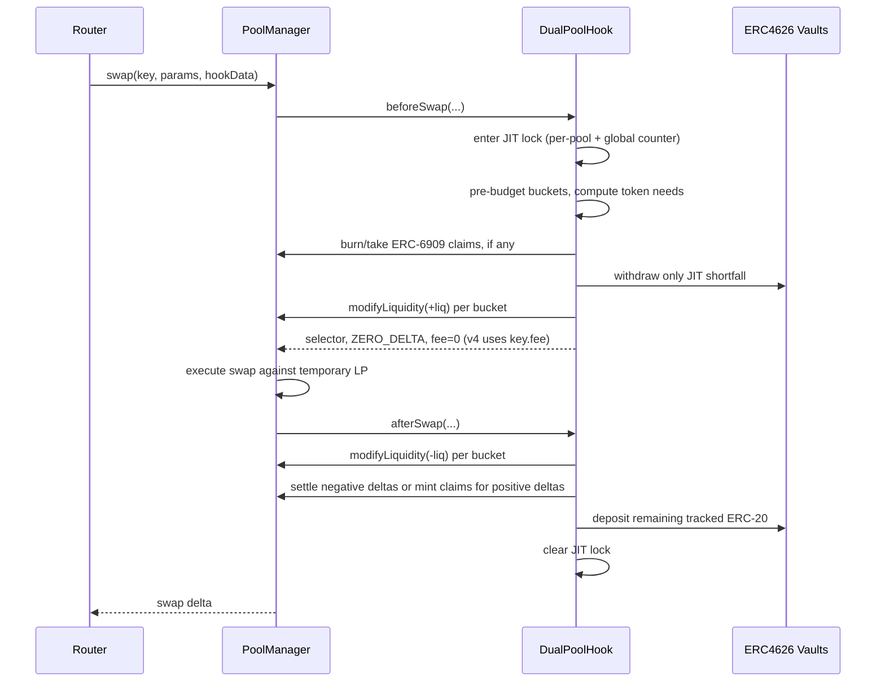

# DualPoolHook Deep Dive

## Overview

`DualPoolHook` is the ALF reference strategy for a market maker that wants Uniswap v4 execution while keeping idle inventory productive between swaps. It combines:

- A static LP fee fixed at pool creation via `PoolKey.fee` (charged natively by v4 on each swap).
- Just-in-time (JIT) liquidity: v4 LP positions exist only during a swap.
- Multi-range liquidity distribution across owner-configured tick buckets.
- ERC4626 rehypothecation for idle token balances.
- Internal, non-transferable pool shares for LP accounting (EIP-4626 virtual-shares inflation defense).

The core idea is simple: between swaps, the hook keeps assets in ERC4626 vaults or tracked raw ERC-20 balances. In `beforeSwap`, it withdraws only the assets needed to provide concentrated liquidity for that swap, adds one or more v4 positions, and lets v4 charge the pool's static fee. After v4 executes the swap, `afterSwap` removes the positions, settles the hook's net PoolManager deltas, and puts any remaining raw ERC-20 back into the configured vaults.

The pool's ordinary v4 liquidity is therefore expected to be zero between swaps. Routers and aggregators discover capacity through the ALF `IALFHook` views (`getReserves`, `getEffectiveLiquidity`, `getIndicativeQuote`, and `swapToPrice`) rather than through persistent PoolManager liquidity.

## Contract Shape

`DualPoolHook` lives at `src/alf/DualPoolHook.sol` and inherits:

```solidity
contract DualPoolHook is
    DualPoolBase,
    PoolVault,
    ReentrancyGuardTransient,
    IUnlockCallback
```

The split is intentional:

- `DualPoolBase` provides the minimal ALF/v4 surface: PoolManager hook callback dispatch, per-pool `livePools` liveness, `IALFHook` metadata, and `beforeInitialize` blocking of direct PM init.
- `PoolVault` (over `MultiAssetVault`) provides per-pool share accounting and the asset ledger across ERC4626 vault shares, ERC-6909 PoolManager claims, and raw ERC-20.
- `ReentrancyGuardTransient` protects user-facing LP entry points.
- `IUnlockCallback` lets `removeLiquidity` redeem pending ERC-6909 claims inside a PoolManager unlock before withdraw math runs.

Note that, unlike other ALF hooks, `DualPoolHook` does not inherit `BaseALFHook` or `SpreadQuoterBase`. It deliberately does not support signed curve updates, attestation-aware discounts, directional bid/ask overrides, or swap-time `hookData` pricing. The LP fee is immutable after `initializePool`; the owner controls only liveness, distribution, vault approvals, and deposit policy.

Ownership uses OpenZeppelin `Ownable2Step` (transferable via two-step handoff), not a permanently fixed admin key.

## Hook Permissions

The hook declares these v4 permissions:

| Permission | Purpose |
| --- | --- |
| `beforeInitialize` | Blocks direct PoolManager initialization so callers must use `initializePool`. |
| `beforeAddLiquidity` | Blocks external LP positions; only the hook can add positions during JIT deployment. |
| `beforeRemoveLiquidity` | Blocks external LP removals; only the hook can remove its JIT positions. |
| `beforeSwap` | Deploys JIT liquidity (no fee override returned). |
| `afterSwap` | Removes JIT liquidity, settles deltas, and re-vaults assets. |

All return-delta flags are false. DualPool does not use `BeforeSwapDelta` or `afterSwap` return deltas to synthesize execution. It lets the normal v4 swap math execute against temporarily deployed LP liquidity while v4 applies `key.fee` natively.

## Pool Initialization

Pools are initialized through:

```solidity
initializePool(PoolKey key, PoolConfig config)
```

`PoolConfig` contains:

- `sqrtPriceX96`: initial v4 pool price.
- `distribution`: tick buckets and weights.
- `allowExternalDeposits`: whether non-owner LP deposits are allowed.
- `vault0` and `vault1`: optional ERC4626 vaults for each currency.
- `minDepositBlocks`: per-pool deposit lock duration (see LP Share Model).

The constructor also sets `maxMinDepositBlocks`, a deployment-wide ceiling on `minDepositBlocks`.

Initialization validates several invariants before the pool is usable:

- `key.fee` must **not** carry `LPFeeLibrary.DYNAMIC_FEE_FLAG`. DualPool uses a static fee fixed at pool creation; dynamic-fee pools are rejected with `DynamicFeeNotSupported`.
- `key.fee` must be at most `LPFeeLibrary.MAX_LP_FEE`.
- `key.hooks` must equal the hook address.
- Native ETH (`address(0)`) is rejected. Operators should use wrapped ETH.
- Any configured ERC4626 vault must report `asset() == currency`.
- Configured vaults must be feeless: `previewDeposit == convertToShares` and `previewRedeem == convertToAssets` (entry/exit fee vaults break JIT round-trips and share math).
- The distribution must contain 1 to 8 buckets, every weight must be nonzero, weights must sum to 10,000 bps, and ticks must be aligned to the pool's `tickSpacing` and within `TickMath` bounds.
- `minDepositBlocks` must be `<= maxMinDepositBlocks`.

Vault addresses are effectively immutable for a pool. The hook sets max token allowance to the configured vaults once during initialization so hot-path JIT deposits avoid an allowance read. That is a deliberate vault-trust tradeoff: a compromised or malicious vault can pull the hook's full balance of that currency, including balances attributed to other pools sharing the same token.

**Liveness:** A newly initialized pool is **not live**. Swaps revert with `PoolNotLive` until the owner calls `bootstrap`, which mints the first shares and flips `livePools[poolId]` to true. This closes the post-init, pre-bootstrap window where a swap could move `slot0.sqrtPriceX96` against zero JIT liquidity.

## Pricing Model

DualPool does **not** maintain bid/ask spread state or return fee overrides from `beforeSwap`.

- The LP fee is `key.fee`, set when the pool is created and never updated by the hook.
- v4 charges that fee on the in-flight swap through normal swap math.
- `hookData` is intentionally ignored by `beforeSwap`, `getIndicativeQuote`, and `swapToPrice`.

**Liveness** is the only swap-time control:

```solidity
mapping(PoolId => bool) public livePools;
```

- `bootstrap` sets `livePools[poolId] = true` on the first successful seed deposit (once per pool).
- `setPoolLive(key, live)` toggles pause/resume without changing the fee.
- When `live == false`, `_beforeSwap` reverts `PoolNotLive(poolId)` instead of deploying zero liquidity and allowing a no-op swap.

`getIndicativeQuote` and `swapToPrice` return `(0, 0)` for paused or empty pools.

## Liquidity Distribution

Each pool has a list of `LiquidityBucket` entries:

```solidity
struct LiquidityBucket {
    int24 tickLower;
    int24 tickUpper;
    uint16 weightBps;
}
```

Buckets may overlap, be asymmetric, or be non-contiguous. Weights must sum to 10,000 bps. A typical stable-pair shape might be:

| Bucket | Tick Range | Weight |
| --- | --- | --- |
| Tight | `[-10, 10]` | 75% |
| Medium | `[-30, 30]` | 15% |
| Wide | `[-60, 60]` | 10% |

That is the conservative "most liquidity at the peg, some depth around it" shape. DualPool can express more interesting structures because buckets do not need to be symmetric, nested, or contiguous. A few useful examples:

### Ultra-tight stable pair

For highly correlated assets with reliable arbitrage and low expected drift, a maker can concentrate most deployable liquidity very close to the current price and keep only a small escape band for larger trades.

| Bucket | Tick Range | Weight |
| --- | --- | --- |
| Micro | `[-1, 1]` | 45% |
| Tight | `[-5, 5]` | 35% |
| Buffer | `[-20, 20]` | 15% |
| Tail | `[-100, 100]` | 5% |

This is the most capital-efficient shape for small swaps near the peg, but it is also the most sensitive to price drift. Once the swap moves through the micro and tight bands, marginal liquidity falls quickly.

### Barbell depth

For pairs that usually trade near the peg but occasionally see large one-directional flow, a maker can keep a tight center while reserving meaningful one-sided depth away from the current tick.

| Bucket | Tick Range | Weight |
| --- | --- | --- |
| Center | `[-5, 5]` | 50% |
| Inner | `[-25, 25]` | 20% |
| Lower Tail | `[-250, -50]` | 15% |
| Upper Tail | `[50, 250]` | 15% |

The tail buckets are out of range at tick 0, so they are mostly one-sided when deployed. They do not improve tiny swaps much, but they give large swaps something to trade into after crossing the center. This can be more capital-efficient than a single wide range because the hook does not dilute all liquidity evenly across unused middle ticks.

### Inventory-skewed distribution

If the maker is long one asset and wants the pool to naturally rebalance through flow, the distribution can overweight the side that sells that asset as price moves. For example, when current tick is near 0 and the pool is token0-heavy:

| Bucket | Tick Range | Weight |
| --- | --- | --- |
| Tight Center | `[-10, 10]` | 35% |
| Upper Sell Wall | `[10, 80]` | 40% |
| Wide Support | `[-80, 80]` | 20% |
| Lower Tail | `[-200, -80]` | 5% |

The upper bucket is token0-heavy while price is below it. If buy pressure pushes price upward, that bucket becomes active and converts token0 into token1. The mirror image can be used when the maker is token1-heavy.

### Peg-defense ladder

For stablecoin or wrapper markets where one side of the peg is more important to defend, buckets can be laddered on the vulnerable side while keeping a smaller symmetric center.

| Bucket | Tick Range | Weight |
| --- | --- | --- |
| Center | `[-8, 8]` | 30% |
| First Defense | `[-40, -8]` | 25% |
| Second Defense | `[-120, -40]` | 25% |
| Recovery Band | `[8, 80]` | 20% |

This shape is intentionally asymmetric. It offers progressively deeper support as price moves below the peg, while still leaving some liquidity available if the market mean-reverts upward. It is useful when the maker has an explicit inventory mandate rather than purely maximizing fee density at the current price.

### Volatility-adaptive rotation

The owner can replace the distribution with `setDistribution`, so a keeper can rotate between bucket shapes by volatility regime:

| Regime | Example Shape | Rationale |
| --- | --- | --- |
| Calm | 80% inside `[-5, 5]`, 20% inside `[-30, 30]` | Maximize near-peg capital efficiency. |
| Choppy | 50% inside `[-15, 15]`, 30% inside `[-60, 60]`, 20% tails | Keep center depth while reducing churn from frequent boundary crossing. |
| Stressed | 25% center, 50% wide `[-250, 250]`, 25% directional tail | Prioritize fill reliability and inventory control over tight quoting. |

Because `setDistribution` is blocked during an active JIT cycle, rotations happen cleanly between swaps. Operators should still treat distribution updates as pricing-sensitive configuration changes.

During a JIT cycle, the hook computes liquidity for each bucket from **effective** (withdrawable-now) assets. For each bucket it **pre-budgets** the balance:

```text
weightedBal0 = bal0 * weightBps / 10_000
weightedBal1 = bal1 * weightBps / 10_000
```

then:

```solidity
LiquidityAmounts.getLiquidityForAmounts(
    sqrtPriceX96,
    sqrtLower,
    sqrtUpper,
    weightedBal0,
    weightedBal1
)
```

Token needs are derived with `SqrtPriceMath.getAmount0Delta` and `getAmount1Delta`, so the hook withdraws only what the JIT positions actually require at the current price. Pre-budgeting (rather than sizing each bucket against the full balance and post-scaling) keeps deployment, indicative quotes, and execution aligned.

`setDistribution` lets the owner replace the bucket list, but it is blocked while any JIT cycle is in flight. This prevents orphaning live positions whose tick ranges would no longer match teardown logic.

`getDistribution(poolId)` exposes the active bucket list (ticks + weights only).

### V3-style position views

Integrators that think in Uniswap V3 terms can call:

- `getLiquidityPositions(key)` — one `LiquidityPositionView` per bucket: `tickLower`/`tickUpper`, `sqrtPriceLowerX96`/`sqrtPriceUpperX96`, pre-budgeted `liquidity` `L`, token `amount0`/`amount1` at the current price, `weightBps`, and `inRange` (whether the current tick lies in `[lower, upper)`).
- `getQuoteLiquidity(key)` — `sum(liquidity)` over in-range buckets; this is the `L` passed to `SwapMath.computeSwapStep` in `getIndicativeQuote`.

Both views use the same effective balances and pre-budget math as JIT deployment. Out-of-range buckets still report their deployable `L` (used on the next swap if price moves into them); only in-range slices count toward the compact quote.

## Asset Accounting

DualPool uses `PoolVault` as a pool-local ledger. For every `(PoolId, Currency)`, it tracks:

- ERC4626 vault shares owned by this pool.
- ERC-6909 claims held in the PoolManager for this pool.
- Raw ERC-20 held by the hook and attributed to this pool.

The hook never treats `IERC20.balanceOf(address(this))` as pool ownership. That global balance can contain assets from many pools sharing the same currency, so all accounting flows through per-pool mappings.

### Total Assets vs Effective Liquidity

`getReserves(key)` returns total economic assets:

```text
vault.convertToAssets(poolVaultShares) + PoolManager claims + tracked raw ERC-20
```

`getEffectiveLiquidity(key)` returns assets that can be deployed immediately:

```text
vault.previewRedeem(poolVaultShares) + PoolManager claims + tracked raw ERC-20
```

LP share math (`previewDeposit`, `previewWithdraw`, pro-rata withdraws) uses **total** assets via `convertToAssets` so LPs retain their full economic claim even when a vault is temporarily illiquid. JIT deployment, indicative quotes, and `getEffectiveLiquidity` use **effective** assets so routing sees only what the hook can realistically withdraw now.

`previewRedeem` is used instead of `maxWithdraw` because curated/gated vaults (e.g. Morpho VaultV2) often return `0` from `maxWithdraw` by design while still reporting meaningful per-share exit value. If a vault cannot satisfy a JIT `withdraw`, the revert bubbles through the swap callback and routers route elsewhere.

### ERC-6909 Claims

After a swap, the hook may have a positive PoolManager delta. It cannot always `take` ERC-20 immediately because the swapper might not have settled by that point in the unlock flow. Instead, DualPool mints ERC-6909 claims to itself and records them in the pool's ledger.

At the start of the next JIT deployment, `_redeemPoolClaims` burns those claims and takes the equivalent ERC-20 into the hook, crediting the pool's tracked raw balance. `removeLiquidity` also redeems claims inside `unlockCallback` before withdraw math, so LPs can exit when post-swap balances sit in claims rather than raw ERC-20 or vault shares.

Claims are therefore a short-lived settlement buffer between swaps (and during LP exits).

## LP Share Model

LPs do not receive ERC-20 share tokens and do not hold native v4 positions. Shares are internal accounting entries in `MultiAssetVault`:

```solidity
mapping(VaultId => uint256) internal _totalShares;
mapping(VaultId => mapping(address => uint256)) internal _userShares;
```

(`VaultId` maps 1:1 with `PoolId` for DualPool pools.)

Inflation defense uses the EIP-4626 **virtual-shares** pattern: conversion math adds virtual assets and `10**decimalsOffset` virtual shares (default offset `12`) so post-bootstrap donation attacks are uneconomic. Bootstrap amounts must exceed a `BootstrapTooSmall` floor so the bootstrapper's economic claim is not permanently diluted by the virtual position.

The owner must seed a pool with:

```solidity
bootstrap(key, amount0, amount1)
```

Bootstrap mints:

```text
sqrt(received0 * received1)
```

shares to the owner and flips the pool live. The owner-supplied amounts set the initial share/asset ratio, which matters for asymmetric-decimal pairs (e.g. USDC/WETH). Bootstrap is owner-only and accepts arbitrary token0/token1 amounts above the minimum floor.

After bootstrap:

- `addLiquidity` mints a requested number of shares and pulls token0/token1 proportional to current total assets.
- Deposits round up so new LPs cannot dilute existing LPs.
- `removeLiquidity` burns shares and returns proportional token0/token1 via `poolManager.unlock` + `unlockCallback`.
- Withdrawals round down so exiting LPs cannot over-withdraw.
- Deposit lock: `minDepositBlocks` (set at init, immutable) controls how many `BlockNumberish` blocks must elapse after a depositor's last deposit before they may withdraw. `0` means no lock (same-block deposit-then-withdraw allowed); `1` reproduces a same-block ban; larger values enforce longer holding periods.

Use `previewDeposit` / `previewWithdraw` for off-chain sizing. Typed getters: `totalShares(poolId)`, `userShares(poolId, user)`, and `sharesOf(key, user)` on the hook.

LP entry points also expose caller slippage bounds:

- `addLiquidity(..., maxAmount0, maxAmount1, deadline)`
- `removeLiquidity(..., minAmount0, minAmount1, deadline)`

These bounds protect LPs from ratio changes, vault share-price moves, and transaction inclusion drift between preview and execution.

## JIT Swap Lifecycle

The swap lifecycle is the heart of the contract.



### `beforeSwap`

When the pool is live:

1. Revert `PoolNotLive` if paused.
2. `_enterJITLock(poolId)` — per-pool lock plus global in-flight counter; rejects same-pool reentrant `_beforeSwap`.
3. Compute effective assets for both currencies.
4. Pre-budget per-bucket liquidity and total token requirements.
5. Redeem this pool's ERC-6909 claims.
6. Withdraw only any remaining shortfall from the configured vaults.
7. Add each nonzero bucket position through `poolManager.modifyLiquidity`.
8. Store each deployed liquidity amount in transient storage so `afterSwap` can remove exactly what was added.
9. Return `ZERO_DELTA` and fee override `0` (static `key.fee` applies).

The LP position salt is constant:

```solidity
bytes32 private constant LP_SALT = bytes32(uint256(0x4455414C)); // "DUAL"
```

That namespaces DualPool's positions from other LP positions on the same pool.

### Swap Execution

The PoolManager executes the swap using ordinary v4 swap math against the temporary positions. DualPool does not return swap deltas; protocol fee behavior and swap accounting remain native to v4.

### `afterSwap`

After a live swap's `beforeSwap`:

1. Read each bucket's active liquidity from transient storage.
2. Remove every active bucket position with the inverse `modifyLiquidity`.
3. Resolve net PoolManager deltas for both currencies:
   - Negative hook delta: settle from tracked per-pool ERC-20 and debit the ledger.
   - Positive hook delta: mint ERC-6909 claims and record them for that pool.
4. Deposit all remaining tracked raw ERC-20 for the pool into configured vaults.
5. `_clearJITLock(poolId)` — clear per-pool lock and decrement global counter.

Transient storage holds per-bucket deployed liquidity (the `ActiveLiquidity` type) and JIT locks (the `JITLock` type). Neither survives past the transaction.

## Quote and Simulation Views

DualPool implements the ALF quote surface:

- `getIndicativeQuote(key, zeroForOne, amountSpecified, hookData)`
- `swapToPrice(key, zeroForOne, amountSpecified, sqrtPriceLimitX96, hookData)`
- `getReserves(key)`
- `getEffectiveLiquidity(key)`
- `maxGas()`
- `isLive()` (hook-level; always `true` — per-pool liveness is `livePools[poolId]`)

For exact-input swaps (`amountSpecified < 0`), `getIndicativeQuote` returns expected output. For exact-output swaps (`amountSpecified > 0`), it returns required input.

The quote path uses:

- Static `key.fee` composed with protocol fees when applicable.
- Effective, not total, assets.
- Current pool `slot0`.
- Active distribution buckets **whose tick range contains the current tick** (summed liquidity).
- A single `SwapMath.computeSwapStep`. `getIndicativeQuote` runs it across the full tick range (`MIN_SQRT_PRICE` / `MAX_SQRT_PRICE`) — it takes no price-limit argument and is **not** bounded by a caller price. Only `swapToPrice` is price-bounded, by its `sqrtPriceLimitX96` argument.

This is a compact quote, not a full virtual tick-walking simulator over all bucket boundary crossings. Tests assert tight relative fidelity (on the order of a few bps) rather than exact equality for broad cases. Routers should treat persistent quote/execution divergence as a routing reputation signal.

**Reserve cap.** Because the step extrapolates the current in-range bucket depth as a constant-liquidity curve to the price extreme, a swap large enough to exhaust the deployed buckets in a real JIT cycle would otherwise report far more output than the pool holds (it can exceed reserves several times over). `_simulateIndicative` therefore caps the output leg at the effective output reserve, so the quote can never exceed `getEffectiveLiquidity`'s output side. For exact output, `getIndicativeQuote` returns `0` when the requested output exceeds deliverable reserves (no honest fill to price). The cap also applies to `swapToPrice`, so the two views stay consistent. The result remains an upper bound fit for ranking; binding slippage protection belongs in the caller/router (a minimum-output / maximum-input check), not in the indicative.

## Access Control

The owner is set at deployment and transferable via `Ownable2Step`. Loss or compromise of the owner key is recoverable only if a pending transfer was already initiated.

| Function | Access |
| --- | --- |
| `initializePool` | Owner |
| `bootstrap` | Owner |
| `addLiquidity` | Owner, or anyone if external deposits are enabled |
| `removeLiquidity` | Share holder |
| `setDistribution` | Owner |
| `refreshVaultApproval` | Owner |
| `setExternalDeposits` | Owner |
| `setPoolLive` | Owner |
| `setActiveTick` | Always reverts |
| `unlockCallback` | PoolManager only |

Direct v4 LP adds/removes are blocked by hook callbacks. Only the hook itself can modify liquidity, and only as part of the JIT lifecycle.

## Reentrancy Model

There are two reentrancy defenses because there are two kinds of entry:

1. User/admin entry points (`bootstrap`, `addLiquidity`, `removeLiquidity`, owner config) use OpenZeppelin's transient `nonReentrant`.
2. PoolManager callbacks use the `JITLock` type's transient locks instead of the OZ guard (no fresh external entry on those paths).

The `JITLock` type (`src/alf/types/JITLock.sol`) provides:

- A **per-pool lock**, derived via `jitLockFor(poolId)`, set by `enter` (in `_beforeSwap`) and cleared by `clear` (in `_afterSwap`). `enter` also rejects reentrant `_beforeSwap` on the same pool (which would orphan outer-cycle positions if an inner cycle cleared the lock early).
- A **global in-flight counter**, read by `requireJITNotInProgress` to reject user/admin calls while any DualPool JIT cycle is active anywhere on this hook. The hook exposes this through a thin `whenJITNotInProgress` modifier that simply calls the guard, so each gated entry point keeps the check visible in its signature.

The global counter closes cross-pool reentry. For example, if a malicious vault callback from pool A tries to call `addLiquidity` on pool B during pool A's JIT cycle, pool B's per-pool lock may be false, but the global counter is nonzero, so the call reverts `JITInProgress`.

## Important Trust Assumptions

- **Vault trust:** ERC4626 vaults receive standing max allowance. Use immutable or well-governed vaults whose risk profile is acceptable. Curated/gated vaults (Morpho VaultV2-style) require trusting the curator not to deny the hook withdrawal access.
- **Feeless vaults:** Entry/exit fee vaults are rejected at init. Non-conformant vaults break JIT economics and LP share fairness.
- **Vault liquidity:** Execution and quotes use `previewRedeem`-sized balances; LP shares still represent total economic assets via `convertToAssets`. A constrained vault can reduce immediately swappable liquidity without reducing LP economic claims.
- **Token compatibility:** Fee-on-transfer and rebasing tokens are unsupported. Inbound LP transfers use `SafeERC20` and measure the actual receipt; a shortfall (`received < want`) reverts `TransferReceiptShortfall` on both `bootstrap` and `addLiquidity`, so a fee-charging token cannot seed a pool. This is a deposit-time check only — it cannot catch a token that begins charging a fee or rebases down *after* deposit, so operators must still restrict pools to non-FoT, non-rebasing tokens. Native ETH is unsupported.
- **Owner trust:** The owner controls liveness, distributions, external deposit permissions, and vault approval refreshes. The LP fee is not owner-updatable after pool creation.
- **Pool isolation:** Per-pool accounting prevents ordinary cross-pool balance leakage, but a malicious vault for a shared currency can still abuse its standing allowance across that currency's hook-wide token balance.

## Core Invariants

The implementation is shaped around these invariants:

- No persistent DualPool v4 liquidity remains after a completed swap.
- Direct PoolManager initialization, add-liquidity, and remove-liquidity paths are blocked.
- Pools reject dynamic-fee `PoolKey.fee`; pricing is static for the pool's lifetime.
- Pools are not swappable until `bootstrap` succeeds.
- Share supply cannot return to zero after bootstrap; virtual-shares math bounds inflation.
- Deposits use rounded-up share conversion; withdrawals use rounded-down conversion.
- Pool ownership of assets is tracked per `(PoolId, Currency)`, not by global token balances.
- Claims minted for one pool cannot be redeemed into another pool's ledger.
- Distribution weights sum to exactly 10,000 bps and bucket count is bounded by 8.
- User/admin mutators cannot run during any in-flight DualPool JIT cycle.
- `hookData` cannot change DualPool pricing or fees.
- JIT allocation pre-budgets per-bucket capital; indicative liquidity matches deployable buckets at the current tick.

## Test Coverage Map

The main test suite is `test/alf/DualPoolHook.t.sol`. It covers:

- Pool initialization, owner checks, static-fee requirement (dynamic-fee rejection), max LP fee, and native-token rejection.
- Feeless-vault probes (entry/exit fee rejection) and vault asset matching.
- `minDepositBlocks` bounds, same-block withdraw policy, and unlock-block behavior.
- Bootstrap behavior, asymmetric initial ratios, `BootstrapTooSmall`, and bootstrap-gated liveness.
- Owner and external LP deposits, withdrawals, slippage bounds, deadlines, and `unlockCallback` auth.
- `removeLiquidity` with pending post-swap claims (unlock + redeem path).
- Direct v4 LP blocking.
- JIT deploy/swap/teardown behavior and zero-liquidity-between-swaps property.
- Reserve vs effective-liquidity (`previewRedeem` sizing, Morpho-style mocks).
- Quote fidelity (multiple sizes, exact output, asymmetric distribution, tick boundaries, max buckets).
- Vault yield accrual and fair share-price treatment for late LPs.
- Cross-pool isolation for vaulted and unvaulted pools sharing currencies.
- Reentrancy protections (vault callbacks, cross-pool JIT, same-pool swap reentry).
- `setActiveTick` disabled, `setDistribution` tick validation, vault deposit/withdraw revert propagation.

Related: `test/alf/DualPoolInvariant.t.sol`, gas snapshots in `test/alf/DualPoolHookGas*.t.sol`.

## Operational Flow

An operator using DualPool normally follows this sequence:

1. Deploy the hook at an address whose v4 permission bits match `getHookPermissions`, with `maxMinDepositBlocks` set appropriately for the chain.
2. Create a `PoolKey` with a **static** `fee` (not `DYNAMIC_FEE_FLAG`) and `hooks = DualPoolHook`.
3. Call `initializePool` with initial price, distribution, deposit policy, vaults, and `minDepositBlocks`.
4. Call `bootstrap` with the first token0/token1 inventory (pool becomes live).
5. Optionally enable external deposits with `setExternalDeposits`.
6. Pause or resume swaps with `setPoolLive`; rotate bucket shapes with `setDistribution` between swaps.
7. Let swaps trigger JIT deployment and teardown automatically.
8. Monitor `getReserves`, `getEffectiveLiquidity`, and quote fidelity from router infrastructure.

To change the LP fee, deploy a new pool with a different `PoolKey.fee`; the hook cannot update it in place.
