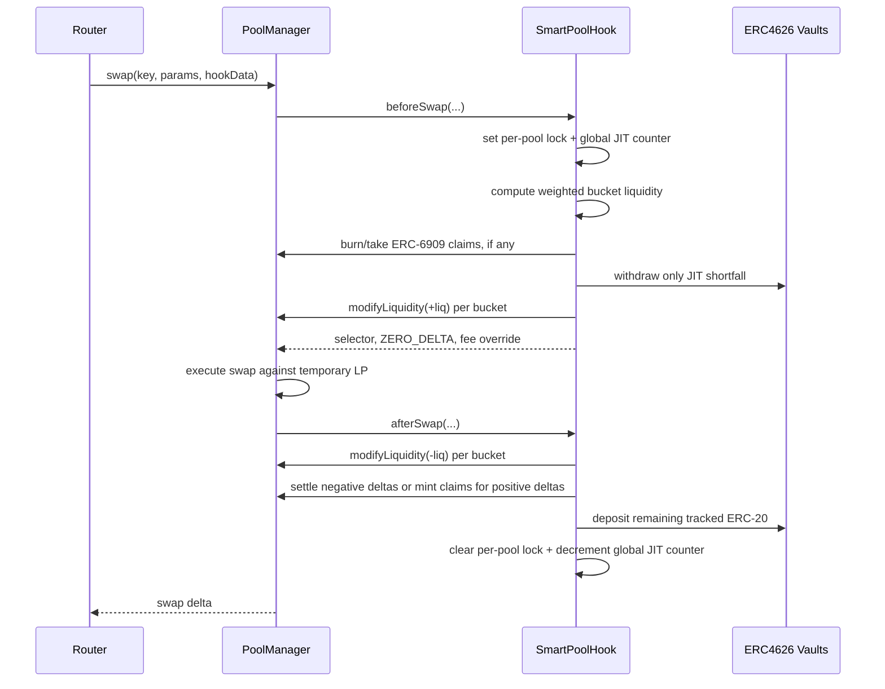

# SmartPoolHook Deep Dive

## Overview

`SmartPoolHook` is the ALF reference strategy for a market maker that wants Uniswap v4 execution while keeping idle inventory productive between swaps. It combines:

- Per-pool bid/ask spread pricing through v4 dynamic fee overrides.
- Just-in-time (JIT) liquidity: v4 LP positions exist only during a swap.
- Multi-range liquidity distribution across owner-configured tick buckets.
- ERC4626 rehypothecation for idle token balances.
- Internal, non-transferable pool shares for LP accounting.

The core idea is simple: between swaps, the hook keeps assets in ERC4626 vaults or tracked raw ERC-20 balances. In `beforeSwap`, it withdraws only the assets needed to provide concentrated liquidity for that swap, adds one or more v4 positions, and returns a directional fee override. After v4 executes the swap, `afterSwap` removes the positions, settles the hook's net PoolManager deltas, and puts any remaining raw ERC-20 back into the configured vaults.

The pool's ordinary v4 liquidity is therefore expected to be zero between swaps. Routers and aggregators discover capacity through the ALF `IALFHook` views (`getReserves`, `getEffectiveLiquidity`, `getIndicativeQuote`, and `swapToPrice`) rather than through persistent PoolManager liquidity.

## Contract Shape

`SmartPoolHook` lives at `src/alf/SmartPoolHook.sol` and inherits:

```solidity
contract SmartPoolHook is SmartPoolBase, PoolVault, ReentrancyGuardTransient
```

The split is intentional:

- `SmartPoolBase` provides the minimal ALF/v4 surface: immutable owner, per-pool `PricingState`, `IALFHook` metadata, PoolManager hook callback dispatch, and dynamic LP fee syncing.
- `PoolVault` provides the per-pool share accounting and asset ledger across ERC4626 vault shares, ERC-6909 PoolManager claims, and raw ERC-20.
- `ReentrancyGuardTransient` protects user-facing LP entry points.

Note that, unlike other ALF hooks, `SmartPoolHook` does not inherit `BaseALFHook` or `SpreadQuoterBase`. It deliberately does not support signed curve updates, attestation-aware discounts, or swap-time `hookData` pricing. The owner controls pricing through storage updates.

## Hook Permissions

The hook declares these v4 permissions:

| Permission | Purpose |
| --- | --- |
| `beforeInitialize` | Blocks direct PoolManager initialization so callers must use `initializePool`. |
| `beforeAddLiquidity` | Blocks external LP positions; only the hook can add positions during JIT deployment. |
| `beforeRemoveLiquidity` | Blocks external LP removals; only the hook can remove its JIT positions. |
| `beforeSwap` | Deploys JIT liquidity and returns the directional fee override. |
| `afterSwap` | Removes JIT liquidity, settles deltas, and re-vaults assets. |

All return-delta flags are false. SmartPool does not use `BeforeSwapDelta` or `afterSwap` return deltas to synthesize execution. It lets the normal v4 swap math execute against temporarily deployed LP liquidity.

## Pool Initialization

Pools are initialized through:

```solidity
initializePool(PoolKey key, PoolConfig config)
```

`PoolConfig` contains:

- `sqrtPriceX96`: initial v4 pool price.
- `pricing`: initial `PricingState` (`bidFeePips`, `askFeePips`, `live`).
- `distribution`: tick buckets and weights.
- `allowExternalDeposits`: whether non-owner LP deposits are allowed.
- `vault0` and `vault1`: optional ERC4626 vaults for each currency.

Initialization validates several invariants before the pool is usable:

- The pool fee must be `LPFeeLibrary.DYNAMIC_FEE_FLAG`; otherwise v4 will not honor per-swap fee overrides.
- `key.hooks` must equal the hook address.
- Native ETH (`address(0)`) is rejected. Operators should use wrapped ETH.
- Bid and ask fees must be less than or equal to `LPFeeLibrary.MAX_LP_FEE`.
- Any configured ERC4626 vault must report `asset() == currency`.
- The distribution must contain 1 to 8 buckets, every weight must be nonzero, weights must sum to 10,000 bps, and ticks must be aligned to the pool's `tickSpacing`.

Vault addresses are effectively immutable for a pool. The hook sets max token allowance to the configured vaults once during initialization so hot-path JIT deposits avoid an allowance read. That is a deliberate vault-trust tradeoff: a compromised or malicious vault can pull the hook's full balance of that currency, including balances attributed to other pools sharing the same token.

## Pricing Model

`SmartPoolBase.PricingState` is:

```solidity
struct PricingState {
    uint24 bidFeePips;
    uint24 askFeePips;
    bool live;
}
```

For swaps:

- `zeroForOne == true` uses `bidFeePips`.
- `zeroForOne == false` uses `askFeePips`.
- The selected fee is returned from `beforeSwap` with `LPFeeLibrary.OVERRIDE_FEE_FLAG`.

Owner controls:

- `updatePricingState(key, state)` replaces the full pricing state and syncs the PoolManager's stored dynamic LP fee to `max(bid, ask)` when live, or `0` when paused.
- `setPoolLive(key, live)` toggles only liveness while preserving bid/ask fees.

When `live == false`, `beforeSwap` returns zero delta and no fee override without deploying JIT liquidity. The swap then executes against whatever persistent v4 liquidity exists, which should normally be zero for a SmartPool.

`hookData` is intentionally ignored by `beforeSwap`, `getIndicativeQuote`, and `swapToPrice`. This is a storage-controlled maker strategy, not a signed swap-payload strategy.

## Liquidity Distribution

Each pool has a list of `LiquidityBucket` entries:

```solidity
struct LiquidityBucket {
    int24 tickLower;
    int24 tickUpper;
    uint16 weightBps;
}
```

Buckets may overlap, be asymmetric, or be non-contiguous. Weights must sum to 10,000 bps. A typical stable-pair shape might be:

| Bucket | Tick Range | Weight |
| --- | --- | --- |
| Tight | `[-10, 10]` | 75% |
| Medium | `[-30, 30]` | 15% |
| Wide | `[-60, 60]` | 10% |

That is the conservative "most liquidity at the peg, some depth around it" shape. SmartPool can express more interesting structures because buckets do not need to be symmetric, nested, or contiguous. A few useful examples:

### Ultra-tight stable pair

For highly correlated assets with reliable arbitrage and low expected drift, a maker can concentrate most deployable liquidity very close to the current price and keep only a small escape band for larger trades.

| Bucket | Tick Range | Weight |
| --- | --- | --- |
| Micro | `[-1, 1]` | 45% |
| Tight | `[-5, 5]` | 35% |
| Buffer | `[-20, 20]` | 15% |
| Tail | `[-100, 100]` | 5% |

This is the most capital-efficient shape for small swaps near the peg, but it is also the most sensitive to price drift. Once the swap moves through the micro and tight bands, marginal liquidity falls quickly.

### Barbell depth

For pairs that usually trade near the peg but occasionally see large one-directional flow, a maker can keep a tight center while reserving meaningful one-sided depth away from the current tick.

| Bucket | Tick Range | Weight |
| --- | --- | --- |
| Center | `[-5, 5]` | 50% |
| Inner | `[-25, 25]` | 20% |
| Lower Tail | `[-250, -50]` | 15% |
| Upper Tail | `[50, 250]` | 15% |

The tail buckets are out of range at tick 0, so they are mostly one-sided when deployed. They do not improve tiny swaps much, but they give large swaps something to trade into after crossing the center. This can be more capital-efficient than a single wide range because the hook does not dilute all liquidity evenly across unused middle ticks.

### Inventory-skewed distribution

If the maker is long one asset and wants the pool to naturally rebalance through flow, the distribution can overweight the side that sells that asset as price moves. For example, when current tick is near 0 and the pool is token0-heavy:

| Bucket | Tick Range | Weight |
| --- | --- | --- |
| Tight Center | `[-10, 10]` | 35% |
| Upper Sell Wall | `[10, 80]` | 40% |
| Wide Support | `[-80, 80]` | 20% |
| Lower Tail | `[-200, -80]` | 5% |

The upper bucket is token0-heavy while price is below it. If buy pressure pushes price upward, that bucket becomes active and converts token0 into token1. The mirror image can be used when the maker is token1-heavy.

### Peg-defense ladder

For stablecoin or wrapper markets where one side of the peg is more important to defend, buckets can be laddered on the vulnerable side while keeping a smaller symmetric center.

| Bucket | Tick Range | Weight |
| --- | --- | --- |
| Center | `[-8, 8]` | 30% |
| First Defense | `[-40, -8]` | 25% |
| Second Defense | `[-120, -40]` | 25% |
| Recovery Band | `[8, 80]` | 20% |

This shape is intentionally asymmetric. It offers progressively deeper support as price moves below the peg, while still leaving some liquidity available if the market mean-reverts upward. It is useful when the maker has an explicit inventory mandate rather than purely maximizing fee density at the current price.

### Volatility-adaptive rotation

The owner can replace the distribution with `setDistribution`, so a keeper can rotate between bucket shapes by volatility regime:

| Regime | Example Shape | Rationale |
| --- | --- | --- |
| Calm | 80% inside `[-5, 5]`, 20% inside `[-30, 30]` | Maximize near-peg capital efficiency. |
| Choppy | 50% inside `[-15, 15]`, 30% inside `[-60, 60]`, 20% tails | Keep center depth while reducing churn from frequent boundary crossing. |
| Stressed | 25% center, 50% wide `[-250, 250]`, 25% directional tail | Prioritize fill reliability and inventory control over tight quoting. |

Because `setDistribution` is blocked during an active JIT cycle, rotations happen cleanly between swaps. Operators should still treat distribution updates as pricing-sensitive configuration changes and coordinate them with spread updates.

During a JIT cycle, the hook computes liquidity for each bucket from the pool's immediately available assets using:

```solidity
LiquidityAmounts.getLiquidityForAmounts(
    sqrtPriceX96,
    sqrtLower,
    sqrtUpper,
    bal0,
    bal1
)
```

It then multiplies that max liquidity by the bucket weight. This means every bucket is sized from the full effective balance, then scaled down by its weight. The resulting liquidity is converted back to exact token needs with `SqrtPriceMath.getAmount0Delta` and `getAmount1Delta`, so the hook withdraws only what the JIT positions actually require at the current price.

`setDistribution` lets the owner replace the bucket list, but it is blocked while any JIT cycle is in flight. This prevents orphaning live positions whose tick ranges would no longer match teardown logic.

## Asset Accounting

SmartPool uses `PoolVault` as a pool-local ledger. For every `(PoolId, Currency)`, it tracks:

- ERC4626 vault shares owned by this pool.
- ERC-6909 claims held in the PoolManager for this pool.
- Raw ERC-20 held by the hook and attributed to this pool.

The hook never treats `IERC20.balanceOf(address(this))` as pool ownership. That global balance can contain assets from many pools sharing the same currency, so all accounting flows through per-pool mappings.

### Total Assets vs Effective Liquidity

`getReserves(key)` returns total economic assets:

```text
vault.convertToAssets(poolVaultShares) + PoolManager claims + tracked raw ERC-20
```

`getEffectiveLiquidity(key)` returns assets that can be deployed immediately:

```text
min(vault.convertToAssets(poolVaultShares), vault.maxWithdraw(address(this)))
+ PoolManager claims
+ tracked raw ERC-20
```

The difference matters when a vault is paused, capped, or utilization constrained. LP share math uses total assets, because LPs own the economic claim. JIT deployment and quotes use effective assets, because execution can only use what the hook can actually withdraw now.

### ERC-6909 Claims

After a swap, the hook may have a positive PoolManager delta. It cannot always `take` ERC-20 immediately because the swapper might not have settled by that point in the unlock flow. Instead, SmartPool mints ERC-6909 claims to itself and records them in the pool's ledger.

At the start of the next JIT deployment, `_redeemPoolClaims` burns those claims and takes the equivalent ERC-20 into the hook, crediting the pool's tracked raw balance. Claims are therefore a short-lived settlement buffer between swaps.

## LP Share Model

LPs do not receive ERC-20 share tokens and do not hold native v4 positions. Shares are internal accounting entries:

```solidity
mapping(PoolId => uint256) public totalShares;
mapping(PoolId => mapping(address => uint256)) public userShares;
```

The owner must seed a pool with:

```solidity
bootstrap(key, amount0, amount1)
```

Bootstrap mints:

```text
sqrt(received0 * received1)
```

total shares, locks `MINIMUM_SHARES` at `address(0)`, and credits the rest to the owner. This mirrors Uniswap V2's first-liquidity defense against share-price inflation attacks. The first deposit also sets the initial share/asset ratio, which is why bootstrap is owner-only and accepts arbitrary token0/token1 amounts.

After bootstrap:

- `addLiquidity` mints a requested number of shares and pulls token0/token1 proportional to current total assets.
- Deposits round up so new LPs cannot dilute existing LPs.
- `removeLiquidity` burns shares and returns proportional token0/token1.
- Withdrawals round down so exiting LPs cannot over-withdraw.
- Same-block withdrawal after a deposit is blocked to reduce atomic deposit-swap-withdraw fee or yield sniping.

`addLiquidity` is owner-only unless `externalDepositsEnabled[poolId]` is true. `removeLiquidity` is available to share holders.

LP entry points also expose caller slippage bounds:

- `addLiquidity(..., maxAmount0, maxAmount1, deadline)`
- `removeLiquidity(..., minAmount0, minAmount1, deadline)`

These bounds protect LPs from ratio changes, vault share-price changes, and transaction inclusion drift between preview and execution.

## JIT Swap Lifecycle

The swap lifecycle is the heart of the contract.



### `beforeSwap`

When the pool is live:

1. Read the pool's `PricingState`.
2. Select bid or ask fee based on swap direction.
3. Set a per-pool transient JIT lock and increment a global transient in-flight counter.
4. Compute effective assets for both currencies.
5. Compute per-bucket liquidity and total token requirements.
6. Redeem this pool's ERC-6909 claims.
7. Withdraw only any remaining shortfall from the configured vaults.
8. Add each nonzero bucket position through `poolManager.modifyLiquidity`.
9. Store each deployed liquidity amount in transient storage so `afterSwap` can remove exactly what was added.
10. Return `ZERO_DELTA` and the directional fee override.

The LP position salt is constant:

```solidity
bytes32 private constant LP_SALT = bytes32(uint256(0x534D5254)); // "SMRT"
```

That namespaces SmartPool's positions from other LP positions on the same pool.

### Swap Execution

The PoolManager then executes the swap using ordinary v4 swap math against the temporary positions. Since SmartPool does not return deltas, protocol fee behavior and swap accounting remain native to v4.

### `afterSwap`

If the pool's JIT lock is set:

1. Read each bucket's active liquidity from transient storage.
2. Remove every active bucket position with the inverse `modifyLiquidity`.
3. Resolve net PoolManager deltas for both currencies:
   - Negative hook delta: the hook owes the PoolManager, so it settles from tracked per-pool ERC-20 and debits the ledger.
   - Positive hook delta: the PoolManager owes the hook, so the hook mints ERC-6909 claims and records them for that pool.
4. Deposit all remaining tracked raw ERC-20 for the pool into configured vaults.
5. Clear the per-pool lock and decrement the global in-flight counter.

Transient storage is used for locks and active liquidity because the data is only meaningful within a single transaction.

## Quote and Simulation Views

SmartPool implements the ALF quote surface:

- `getIndicativeQuote(key, zeroForOne, amountSpecified, hookData)`
- `swapToPrice(key, zeroForOne, amountSpecified, sqrtPriceLimitX96, hookData)`
- `getReserves(key)`
- `getEffectiveLiquidity(key)`
- `maxGas()`
- `isLive()`

For exact-input swaps (`amountSpecified < 0`), `getIndicativeQuote` returns expected output. For exact-output swaps (`amountSpecified > 0`), it returns required input.

The quote path uses:

- Stored `PricingState`.
- Effective, not total, assets.
- Current pool `slot0`.
- v4 protocol fee composition.
- Active distribution buckets at the current tick.
- A single `SwapMath.computeSwapStep` bounded by the caller's price limit.

This is a compact quote, not a full virtual tick-walking simulator over all future bucket boundary crossings. The tests therefore assert tight relative fidelity rather than exact equality for broad cases. Routers should treat persistent quote/execution divergence as a routing reputation signal.

## Access Control

The owner is immutable and cannot be transferred. Loss or compromise of the owner key is unrecoverable at the hook level.

| Function | Access |
| --- | --- |
| `initializePool` | Owner |
| `bootstrap` | Owner |
| `addLiquidity` | Owner, or anyone if external deposits are enabled |
| `removeLiquidity` | Share holder |
| `setDistribution` | Owner |
| `refreshVaultApproval` | Owner |
| `setExternalDeposits` | Owner |
| `updatePricingState` | Owner |
| `setPoolLive` | Owner |
| `setActiveTick` | Always reverts |

Direct v4 LP adds/removes are blocked by hook callbacks. Only the hook itself can modify liquidity, and only as part of the JIT lifecycle.

## Reentrancy Model

There are two reentrancy defenses because there are two kinds of entry:

1. User/admin entry points (`bootstrap`, `addLiquidity`, `removeLiquidity`) use OpenZeppelin's transient `nonReentrant`.
2. PoolManager callbacks cannot use that same fresh-entry guard, so SmartPool maintains its own transient JIT locks.

The JIT lock system has:

- A per-pool lock, used by `afterSwap` to determine whether this pool needs teardown.
- A global in-flight counter, used by `whenJITNotInProgress` to reject user/admin calls while any SmartPool JIT cycle is active.

The global counter closes cross-pool reentry. For example, if a malicious vault callback from pool A tries to call `addLiquidity` on pool B, pool B's per-pool lock would be false, but the global counter is nonzero, so the call reverts.

## Important Trust Assumptions

- **Vault trust:** ERC4626 vaults receive standing max allowance. Use immutable or well-governed vaults whose risk profile is acceptable.
- **Vault liquidity:** Execution and quotes use `maxWithdraw`-capped balances, but LP shares still represent total economic assets. A constrained vault can reduce immediately swappable liquidity without reducing LP economic claims.
- **Token compatibility:** Inbound transfers use `SafeERC20`, and received amounts are measured to reject fee-on-transfer or rebasing shortfalls. Native ETH is unsupported.
- **Owner trust:** The owner controls pricing, liveness, distributions, external deposit permissions, and vault approval refreshes.
- **Pool isolation:** Per-pool accounting prevents ordinary cross-pool balance leakage, but a malicious vault for a shared currency can still abuse its standing allowance across that currency's hook-wide token balance.

## Core Invariants

The implementation is shaped around these invariants:

- No persistent SmartPool v4 liquidity remains after a completed swap.
- Direct PoolManager initialization, add-liquidity, and remove-liquidity paths are blocked.
- Pool share supply cannot return to zero after bootstrap because dead shares are locked.
- Deposits use rounded-up share conversion; withdrawals use rounded-down conversion.
- Pool ownership of assets is tracked per `(PoolId, Currency)`, not by global token balances.
- Claims minted for one pool cannot be redeemed into another pool's ledger.
- Distribution weights sum to exactly 10,000 bps and bucket count is bounded by 8.
- User/admin mutators cannot run during any in-flight SmartPool JIT cycle.
- `hookData` cannot change SmartPool pricing.

## Test Coverage Map

The main test suite is `test/alf/SmartPoolHook.t.sol`. It covers:

- Pool initialization, owner checks, dynamic-fee requirement, and native-token rejection.
- Vault configuration and vault asset matching.
- Bootstrap behavior, locked minimum shares, and asymmetric initial ratios.
- Owner and external LP deposits, withdrawals, slippage bounds, and same-block withdrawal rejection.
- Direct v4 LP blocking.
- JIT deploy/swap/teardown behavior and zero-liquidity-between-swaps property.
- Reserve and effective-liquidity views.
- Quote behavior and explicit `hookData` ignoring.
- Vault yield accrual and fair share-price treatment for late LPs.
- Cross-pool isolation for vaulted and unvaulted pools sharing currencies.
- Reentrancy protections around vault callbacks and in-flight JIT cycles.

## Operational Flow

An operator using SmartPool normally follows this sequence:

1. Deploy the hook at an address whose v4 permission bits match `_hookPermissions`.
2. Create a `PoolKey` with `fee = LPFeeLibrary.DYNAMIC_FEE_FLAG` and `hooks = SmartPoolHook`.
3. Call `initializePool` with initial price, pricing state, distribution, deposit policy, and vaults.
4. Call `bootstrap` with the first token0/token1 inventory.
5. Optionally enable external deposits with `setExternalDeposits`.
6. Update spreads through `updatePricingState` or pause/resume with `setPoolLive`.
7. Let swaps trigger JIT deployment and teardown automatically.
8. Monitor `getReserves`, `getEffectiveLiquidity`, and quote fidelity from router infrastructure.
