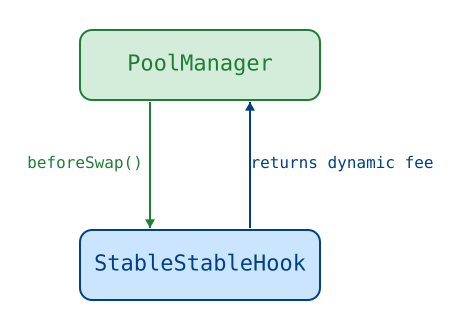
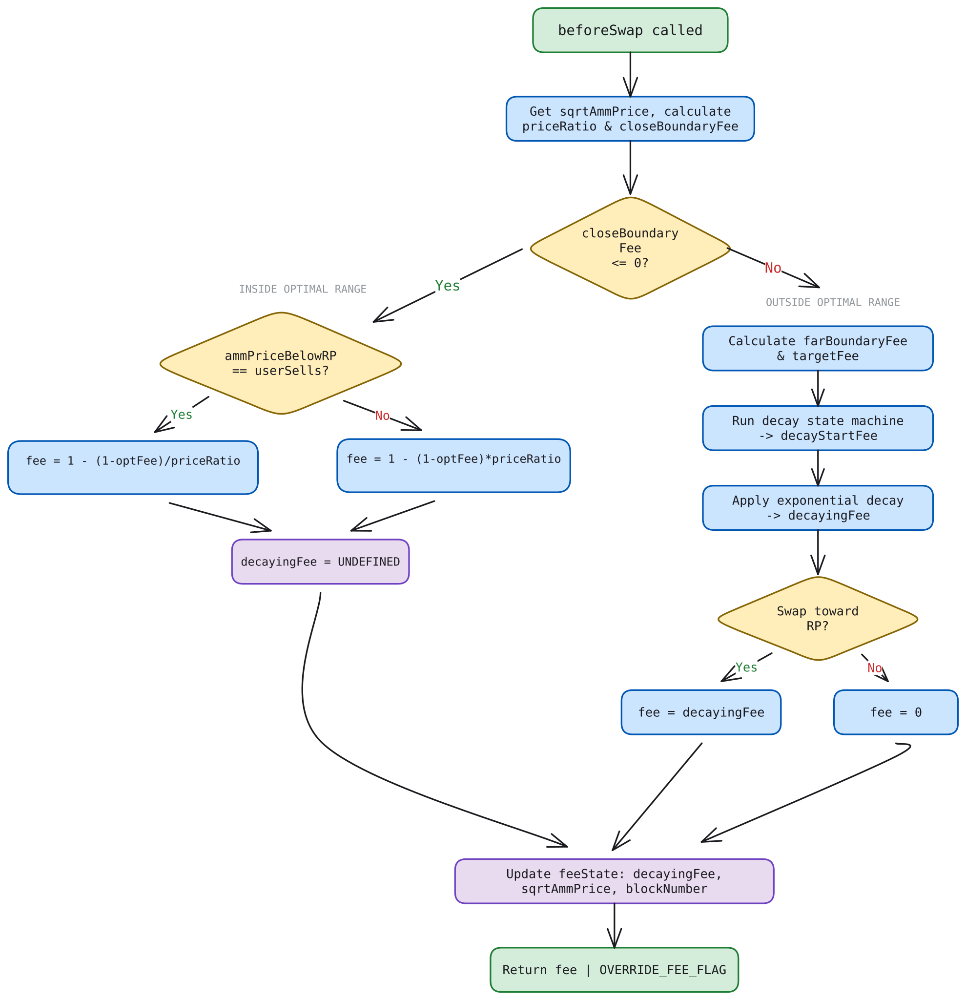
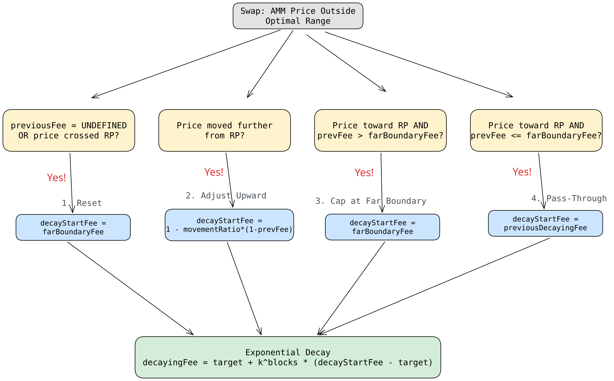

# StablePairHook

Technical specification for a dynamic fee hook targeting pools of two assets expected to hold the same price on Uniswap v4.

## Table of Contents

- [Overview](#overview)
- [Architecture](#architecture)
- [Configuration](#configuration)
  - [FeeConfig](#feeconfig-per-pool)
  - [FeeState](#feestate-per-pool-updated-once-per-block)
  - [Validation Rules](#validation-rules)
  - [Access Control](#access-control)
- [The Optimal Range](#the-optimal-range)
  - [Definition](#definition)
  - [Price Ratio](#price-ratio)
  - [Close Boundary Fee](#close-boundary-fee)
  - [Far Boundary Fee](#far-boundary-fee)
- [beforeSwap Algorithm](#beforeswap-algorithm)
  - [Inside Optimal Range](#inside-optimal-range)
  - [Outside Optimal Range](#outside-optimal-range)
- [Decay Mechanism](#decay-mechanism)
  - [Phase 1: Fee Adjustment](#phase-1-fee-adjustment-state-machine)
  - [Phase 2: Exponential Decay](#phase-2-exponential-decay)
- [Invariants](#invariants)

---

## Overview

`StablePairHook` implements a dynamic fee mechanism for Uniswap v4 pools containing two stable assets (e.g., USDC/USDT). The hook overrides the LP fee on every swap via `beforeSwap`, computing a dynamic fee based on how far the AMM price has drifted from a configured reference price. To prevent swap splitting from reducing aggregate fees, the hook caches the AMM price on the first swap of each block and uses that cached price for all subsequent swaps in the same block.

> **Terminology — "pre-impact price":** Throughout this document, _pre-impact price_ refers to the AMM price adjusted for the fee: `ammPrice × (1 - fee)` for sells, `ammPrice / (1 - fee)` for buys. This is the price used to derive fee formulas and does not account for price impact from the swap itself. Actual execution prices will differ depending on swap size and liquidity depth.

### Design Goals

These goals address loss-versus-rebalancing: the value LPs give up when the pool quotes a stale price and informed flow trades against it. A single static fee cannot — the fee low enough to keep a pool competitive for ordinary flow is far too small to price the option arbitrageurs hold on every deviation.

1. **Consistent pre-impact prices.** Inside a tight band around the reference price, fees are set such that the pre-impact price for all buys is one value and for all sells is another, regardless of the AMM spot price.

2. **Arbitrage incentives.** Outside that band, the fee charged on corrective swaps (those pushing price back toward the reference) decays over time, making it progressively cheaper for arbitrageurs to close the mispricing.

3. **Zero fee for adverse movement.** Swaps that push the price further from the reference pay no fee. These swaps provide volume without extracting value from the mispricing, so penalizing them would reduce activity without benefiting LPs.

---

## Architecture



`PoolManager` calls `beforeSwap` on every swap. On the first swap of a new block, the hook reads the current AMM price and caches it in `FeeState`. On subsequent swaps in the same block, the hook uses the cached start-of-block price. The fee is computed using the price ratio relative to the reference and returned as a dynamic fee override.

`StablePairHook` is a UUPS implementation deployed behind an ERC1967 proxy — the proxy (whose mined address encodes the hook permission flags) is the registered v4 hook, and all state described below lives in the proxy's storage under ERC-7201 namespaces. See the [Upgrade Runbook](./UpgradeRunbook.md) for storage, upgrade, and deployment rules.

---

## Configuration

The hook maintains data for each pool in two data structures: **FeeConfig** (economic parameters, set at pool creation and updatable by the config manager) and **FeeState** (mutable state, updated once per block on the first swap).

### FeeConfig (per pool)

| Field                   | Type      | Description                                                                                                                                                                                                                                                                                                              |
| ----------------------- | --------- | ------------------------------------------------------------------------------------------------------------------------------------------------------------------------------------------------------------------------------------------------------------------------------------------------------------------------ |
| `k`                     | `uint24`  | Per-block decay factor, in bips, in Q24 format. Example: `16,609,443 Q24 ≈ 0.99`, meaning the fee retains 99% of its value each block.                                                                                                                                                                                   |
| `optimalFeeE6`          | `uint24`  | Fee rate defining the optimal range width around the reference price in **price space** in 1e6 precision. Example: `90` = 0.009%. Maximum: `10,000` (1%).                                                                                                                                                                |
| `targetMultiplier`      | `uint8`   | Controls how aggressively the target fee drops below `farBoundaryFee` as the price moves further out of range: `targetFee = farBoundaryFee - closeBoundaryFee × targetMultiplier / 100`. `100` = full subtraction (tightest spread), `50` = half, `0` = no reduction (target stays at the far boundary). Maximum: `100`. |
| `referenceSqrtPriceX96` | `uint160` | Reference center price in sqrt Q96 format — the "true" exchange rate of the stable pair.                                                                                                                                                                                                                                 |

### FeeState (per pool, updated once per block)

| Field             | Type      | Description                                                                                                                                                                                                                                                                                 |
| ----------------- | --------- | ------------------------------------------------------------------------------------------------------------------------------------------------------------------------------------------------------------------------------------------------------------------------------------------- |
| `decayingFeeE12`  | `uint40`  | Decaying fee in 1e12 precision from the last feeState update this block, or `UNDEFINED_DECAYING_FEE_E12` if that swap was inside the optimal range.                                                                                                                                         |
| `sqrtAmmPriceX96` | `uint160` | AMM sqrt price at the start of the most recently swapped block (before its first swap). Used as the cached price for same-block swaps and for cross-block price movement detection. `0` when the pool is initialized or its config is updated, forcing the next swap to read a fresh price. |
| `blockNumber`     | `uint40`  | Block number of the most recent feeState write (first swap of a block, or pool init/config reset). Used to detect same-block swaps (skip state updates) and to compute elapsed blocks for decay. Never a sentinel — a reset is signaled by `sqrtAmmPriceX96 = 0`, not by this field.        |

### Validation Rules

**`k`**: Must be nonzero (`k = 0` would cause instant decay and division-by-zero risk). The log-space decay rate is not stored: the slow path derives `logK = ceil(uint256(-lnWad(k_as_wad)) / 2^24)` from `k` at swap time (`StableFeeCalculation.deriveLogK`, ~870 gas, paid only when `blocksPassed > 4`). Rounding **up** keeps the reconstructed exponent at least as large as the true `-ln(k)`, so the slow-path decay factor never exceeds the exact `k^n` — decay never runs slower than configured and stays monotone across the blocksPassed 4→5 switch from exact `k^n` multiplication (fast path) to the approximate `exp(-logK * n)` formula (slow path). Since the `uint24` type caps `k` below Q24 1.0, `-ln(k) > 0` always and the ceil rounding keeps the result nonzero, so `logK = 0` (which would disable decay entirely) is unreachable.

**`optimalFeeE6`**: Must satisfy `optimalFeeE6 <= MAX_OPTIMAL_FEE_E6` (10,000 = 1%).

**`targetMultiplier`**: Must satisfy `targetMultiplier <= MAX_TARGET_MULTIPLIER` (100).

**`referenceSqrtPriceX96`**: Must be bounded such that the full optimal range stays within Uniswap v4's valid sqrt price range `[MIN_SQRT_PRICE, MAX_SQRT_PRICE)`. Since the optimal range is defined in price space, the sqrt price bounds use `sqrt(1 - fee)`:

```
referenceSqrtPriceX96 * sqrt(1 - maxOptimalFee) >= MIN_SQRT_PRICE
referenceSqrtPriceX96 / sqrt(1 - maxOptimalFee)  < MAX_SQRT_PRICE
```

### Access Control

Access control uses OpenZeppelin `AccessControl` roles, granted atomically when the proxy is initialized (`initialize(owner, poolInitializer, configManager)`):

| Role                    | Permissions                                                                                                                                                                        |
| ----------------------- | ---------------------------------------------------------------------------------------------------------------------------------------------------------------------------------- |
| `DEFAULT_ADMIN_ROLE`    | Role admin of both operational roles and of itself — it alone grants and revokes roles. Also authorizes implementation upgrades (`_authorizeUpgrade`).                             |
| `POOL_INITIALIZER_ROLE` | Can call `initializePool()` to create new pools.                                                                                                                                   |
| `CONFIG_MANAGER_ROLE`   | Can call `updateFeeConfig()` and `batchUpdateFeeConfig()`, which require the pool to be initialized. Every config update validates the new config and resets the pool's fee state. |

The two operational roles hold only their operational powers — neither can grant or revoke roles.

The `_beforeInitialize` hook unconditionally reverts. v4 skips hook callbacks when the caller is the hook itself, so the only way to create a pool is through `initializePool()`, which calls `PoolManager.initialize()` from the hook. This guarantees the fee config is set atomically with pool creation — no pool can exist without a valid config. Conversely, `updateFeeConfig()` and `batchUpdateFeeConfig()` revert (`PoolNotInitialized`) for a pool that has not been initialized on the PoolManager, so config cannot exist without a live pool either.

---

## The Optimal Range

### Definition

The optimal range is a price band around the reference price, defined in **price space** (not sqrt price space):

```
lowerBound = RP × (1 - optimalFee)
upperBound = RP / (1 - optimalFee)
```

where `RP` is the reference price in price space (i.e., `referenceSqrtPriceX96` squared).

The asymmetry is intentional. Multiplying by `(1 - f)` on the lower side and dividing by `(1 - f)` on the upper side ensures that a buy-then-sell roundtrip at the boundaries costs the same percentage in both directions.

### Price Ratio

To unify the math across "price above RP" and "price below RP", the system computes a **normalized price ratio** that is always `≤ 1`:

```
priceRatio = min(ammPrice, RP) / max(ammPrice, RP)
```

This collapses symmetric cases into a single formula throughout the fee logic.

### Close Boundary Fee

The close boundary fee measures how far the AMM price sits from the **nearer** edge of the optimal range. Its sign is the primary branching condition in `beforeSwap`: it determines whether the current price is inside or outside the range.

Derived by setting the pre-impact price equal to the close boundary. Both the `ammPrice < RP` and `ammPrice > RP` cases collapse via the normalized `priceRatio` into:

```
closeBoundaryFeeE12 = 1 - priceRatio / (1 - optimalFee)
```

**Sign convention:**

- `closeBoundaryFeeE12 ≤ 0` → AMM price is **inside** the optimal range
- `closeBoundaryFeeE12 > 0` → AMM price is **outside** the optimal range

### Far Boundary Fee

The far boundary fee measures how far the AMM price sits from the **farther** edge of the optimal range. It is only relevant when the price is outside the optimal range, where it serves as the upper bound for the decaying fee and contributes to the target fee calculation.

Same derivation approach — set the pre-impact price equal to the far boundary:

```
farBoundaryFeeE12 = 1 - (1 - optimalFee) × priceRatio
```

**Key property:** `farBoundaryFee ≥ closeBoundaryFee` whenever the price is outside the optimal range.

---

## beforeSwap Algorithm



`beforeSwap` is the entry point for all fee logic. On the first swap of a new block, it reads the current AMM price and caches it in `FeeState`. On subsequent swaps in the same block, it uses the cached price. The fee is computed from the price ratio relative to the reference.

**Per-block caching consequence:** All swaps within the same block see the same cached price. This means fees do not change within a block — even if swaps push the price further from reference, the corrective fee stays constant. Fee adjustments (Phase 1 of the decay mechanism) only occur across block boundaries. This block-granularity pinning is intentional: fee inputs are constant within a `block.number` regardless of how transactions are sequenced or confirmed within it. Refreshing the cached price more often than once per block would reintroduce the swap-splitting advantage the cache exists to prevent.

**Intra-block staleness tradeoff:** The cached price becomes stale as swaps move the AMM price during the block. Later swaps in the same block may see a fee that doesn't reflect the current AMM price. For stable pools this impact is minimal — price movements between pegged assets are small, and staleness is bounded to a single block.

**Intra-block reference crossing:** Because the cached start-of-block price also determines `ammPriceBelowRP` — the flag that selects which swap direction is "toward reference" (fee-charged) and which is "away" (zero-fee) — a within-block swap that pushes the true price _across_ the reference to the opposite side inverts the fee for the remainder of that block: the now-corrective direction is charged zero, and the now-adverse direction pays the decaying fee. The next block refreshes the cache and restores the correct direction. This is an accepted consequence of block-granularity pinning: deriving the direction from the live price would reintroduce the same within-block swap-splitting advantage the cache exists to prevent. The effect is bounded to a single block and to the overshoot past the reference, and the swap that creates the crossing pays the correct fee on that leg. During a depeg-recovery block a single block can traverse the (at most `±optimalFee`-wide) optimal range, so a crossing is more likely there than during ordinary trading.

**Protocol fee:** The fee calculations adjust the LP fee to hit the target pre-impact buy/sell prices — the pool's `protocolFee` is not taken into account. If one is enabled, it widens the effective spread; `optimalFeeE6` can be adjusted to compensate if desired.

### Inside Optimal Range

When `closeBoundaryFeeE12 ≤ 0`, the AMM price is within the optimal range. The hook enforces **consistent pre-impact prices** for all swappers regardless of where the spot price sits within the band:

- All sells have pre-impact price = `RP × (1 - optimalFee)` (lower bound)
- All buys have pre-impact price = `RP / (1 - optimalFee)` (upper bound)

The fee formula depends on swap direction relative to the price's position. The branching condition is `ammPriceBelowRP == userSellsZeroForOne`:

**Swap toward the closer boundary** (condition is `true`):

```
fee = 1 - (1 - optimalFee) / priceRatio
```

**Swap toward the farther boundary** (condition is `false`):

```
fee = 1 - (1 - optimalFee) × priceRatio
```

These formulas mirror the close and far boundary fee derivations — same approach of setting the pre-impact price equal to the boundary and solving for the fee. At the reference price (`priceRatio = 1`), both produce exactly `optimalFee`. As the price drifts toward one boundary, the fee for swaps pushing toward it decreases (approaching 0), while the fee for swaps pushing away increases (approaching ≈ `2 × optimalFee`).

### Outside Optimal Range

When `closeBoundaryFeeE12 > 0`, the fee system switches regime.

#### Direction-Based Zero Fee

Swaps that push the price **further from the reference** pay zero fee:

```solidity
lpFeeE12 = (ammPriceBelowRP == userSellsZeroForOne) ? 0 : decayingFeeE12;
```

The condition `ammPriceBelowRP == userSellsZeroForOne` is `true` when the swap worsens the mispricing — either price is below RP and the user sells token0 (pushing it further down), or price is above RP and the user buys token0 (pushing it further up). Penalizing these swaps would reduce volume without helping LPs. Fees are only charged on swaps pushing price **back toward** the reference, since those swappers benefit from buying a temporarily underpriced asset.

**Accepted limitation:** this check reads the cached price. With zero active liquidity the pool price moves for free (v4 swaps traverse empty ticks at no cost), so the cache can end up on the opposite side of the reference from the live price — and a corrective swap against liquidity minted at that displaced price is charged 0. Requires a same-block mint that clears its own slippage, and self-heals on the next block.

#### Target Fee

The target fee is the asymptotic destination for the decaying fee:

```
targetFee = farBoundaryFee - closeBoundaryFee × targetMultiplier / 100
```

The further the price drifts outside the range (larger `closeBoundaryFee`), the more the target drops below `farBoundaryFee`. This creates a progressively stronger arbitrage incentive: the further the price drifts, the cheaper it becomes for arbitrageurs to push it back. `targetMultiplier` controls the strength of the effect: `100` = full subtraction (tightest spread), `50` = half, `0` = no reduction — the target stays at the far boundary and only price movement adjusts the fee (see invariant 1b for the saturation consequence of `targetMultiplier = 0`).

**Properties:** `0 ≤ targetFee ≤ farBoundaryFee` when outside the optimal range. The gap between `targetFee` and `farBoundaryFee` is exactly `closeBoundaryFee × targetMultiplier / 100`.

**Decay-start clamp:** When `targetMultiplier / 100 > (1 - optimalFee)²`, the target fee _rises_ as the price moves back toward the reference. A previous fee that decayed toward an earlier (lower) target can then sit below the new target, so the decay start is clamped up to the target before decaying (`decayStartFee = max(decayStartFee, targetFee)`).

#### Decaying Fee

The fee charged to swaps pushing price toward RP is a **decaying fee** that starts high and exponentially converges toward the target fee. The fee resets to `farBoundaryFee` when the price first leaves the optimal range, decays between blocks based on elapsed time, and is adjusted for price movement. The full algorithm is described in the next section.

---

## Decay Mechanism

The decay mechanism operates in two phases: (1) adjust the previous fee based on price movement since the previous block's first swap, then (2) apply exponential decay toward the target fee.

### Phase 1: Fee Adjustment (State Machine)



The previous block's first swap state determines which of four adjustment paths applies before exponential decay.

#### Case 1: Reset

**Condition:** `previousDecayingFeeE12 == UNDEFINED` (previous swap was inside the optimal range), or the price crossed the reference price since the last swap (was above RP, now below, or vice versa).

**Action:** `decayStartFee = farBoundaryFee`

**Rationale:** No meaningful previous fee exists to adjust from. Starting at the far boundary is the conservative choice — it represents the maximum economically coherent fee.

#### Case 2: Upward Adjustment

**Condition:** Price moved **further** from the reference (still on the same side of RP, but more extreme).

**Action:** Adjust the previous fee to preserve the same pre-impact price at the new (worse) AMM price.

**Derivation:** The adjusted fee preserves the same pre-impact price the previous fee would have produced, despite the worsened AMM price. Setting pre-impact prices equal and solving:

```
decayStartFee = 1 - priceMovementRatio × (1 - previousDecayingFee)
```

where priceMovementRatio = min(ammPrice_new, ammPrice_prev) / max(ammPrice_new, ammPrice_prev), always ≤ 1. Since priceMovementRatio < 1 when price worsens, this guarantees decayStartFee ≥ previousDecayingFee.

#### Case 3: Cap at Far Boundary

**Condition:** Price moved **toward** the reference, but the previous fee exceeds the new `farBoundaryFee`.

**Action:** `decayStartFee = farBoundaryFee`

**Rationale:** As the price improves (moves toward RP), `farBoundaryFee` decreases. The fee should never exceed what the far boundary would produce at the current price.

#### Case 4: Pass-Through

**Condition:** Price moved toward the reference, and `previousDecayingFee ≤ farBoundaryFee`.

**Action:** `decayStartFee = previousDecayingFee` (no adjustment).

**Rationale:** The previous fee remains within valid bounds. Exponential decay handles the reduction from here.

### Phase 2: Exponential Decay

After adjustment, the fee decays exponentially toward the target:

```
decayingFee = targetFee + k^blocksPassed × (decayStartFee - targetFee)
```

where `k < 1` (e.g., 0.99) is the per-block retention factor. As `blocksPassed` increases, `k^blocksPassed → 0`, so `decayingFee → targetFee`.

**Implementation:** `k^blocksPassed` is computed via direct multiplication (`fastPow`) for 1–4 blocks, or `exp(-logK × n)` using Solady's `expWad` for 5+ blocks, with `logK` derived from `k` on the fly (`deriveLogK`). Both paths are mathematically equivalent: `k^n = exp(-n × (-ln(k)))`.

---

## Invariants

The following properties hold for all valid inputs (any valid price, swap direction, and block gap):

| #   | Invariant                                                              | Description                                                                                                                                                                                                                                                                                                                                                                                                                                                                                                                                                                                                                                                                                                                                                                                                                                                                                                                                                                                                                                                                                                                                                                                                                                                                                                                                                                                                                                                                                                                                                                                                                                                                                                                                                                |
| --- | ---------------------------------------------------------------------- | -------------------------------------------------------------------------------------------------------------------------------------------------------------------------------------------------------------------------------------------------------------------------------------------------------------------------------------------------------------------------------------------------------------------------------------------------------------------------------------------------------------------------------------------------------------------------------------------------------------------------------------------------------------------------------------------------------------------------------------------------------------------------------------------------------------------------------------------------------------------------------------------------------------------------------------------------------------------------------------------------------------------------------------------------------------------------------------------------------------------------------------------------------------------------------------------------------------------------------------------------------------------------------------------------------------------------------------------------------------------------------------------------------------------------------------------------------------------------------------------------------------------------------------------------------------------------------------------------------------------------------------------------------------------------------------------------------------------------------------------------------------------------- |
| 1   | `lpFeeE12 ≤ ONE_E12`                                                   | Fee never exceeds 100%.                                                                                                                                                                                                                                                                                                                                                                                                                                                                                                                                                                                                                                                                                                                                                                                                                                                                                                                                                                                                                                                                                                                                                                                                                                                                                                                                                                                                                                                                                                                                                                                                                                                                                                                                                    |
| 1b  | Charged fee `< 1e6` (E6)                                               | The far-boundary fee saturates to exactly 100% in E12 when the price is ~276k ticks from reference. With `targetMultiplier ≥ 1` this self-heals — the decay pulls the charged fee below 100% after one block — but with `targetMultiplier = 0` the target equals the saturated start, so 100% is a fixed point of the decay and would be charged indefinitely. At a charged fee of exactly 1e6, exact-output swaps revert (`InvalidFeeForExactOut`) and exact-input swaps consume the entire input as fee: the price can still coast across _empty_ tick ranges (zero-liquidity steps consume no input) but stops at the first active liquidity — so with any liquidity in the recovery path, even attacker-seeded dust, the pool deadlocks, since toward-reference swaps are the only way for the price (and thus the fee) to recover. The fee v4 charges is not the hook's LP fee alone: `Pool.swap` compounds it with the directional protocol fee (protocol taken from the input first, LP fee on the remainder) and rounds the combined fee **up** to a whole pip, so an LP fee of 999,999 compounds to exactly 1e6 for _any_ nonzero protocol fee. `toFeeE6` therefore clamps the LP fee to `MAX_FEE_E6` = 999,998, which compounds to at most 999,999 for all protocol fees up to `MAX_PROTOCOL_FEE` (0.1%). The guarantee this buys is deliberately narrow: exact-output swaps stay available, and an exact-input swap moves the price through active liquidity iff its post-fee remainder is nonzero — at a combined fee of 999,999 only 1/1e6 of the input survives, so inputs below 1e6 raw units truncate to a zero remainder and buy nothing. The clamp guarantees recovery is _possible_ for sufficiently large inputs, not that every swap moves the price. |
| 2   | `targetFee ≤ decayingFee ≤ decayStartFee`                              | Decay is monotonically bounded between the target and the starting fee.                                                                                                                                                                                                                                                                                                                                                                                                                                                                                                                                                                                                                                                                                                                                                                                                                                                                                                                                                                                                                                                                                                                                                                                                                                                                                                                                                                                                                                                                                                                                                                                                                                                                                                    |
| 3   | Consistent pre-impact prices                                           | Inside the optimal range, pre-impact buy price = `RP / (1 - optimalFee)` and pre-impact sell price = `RP × (1 - optimalFee)` for all AMM prices within the range.                                                                                                                                                                                                                                                                                                                                                                                                                                                                                                                                                                                                                                                                                                                                                                                                                                                                                                                                                                                                                                                                                                                                                                                                                                                                                                                                                                                                                                                                                                                                                                                                          |
| 4   | No revert                                                              | `beforeSwap` never reverts.                                                                                                                                                                                                                                                                                                                                                                                                                                                                                                                                                                                                                                                                                                                                                                                                                                                                                                                                                                                                                                                                                                                                                                                                                                                                                                                                                                                                                                                                                                                                                                                                                                                                                                                                                |
| 5   | Equal start and target → no decay                                      | If `decayStartFeeE12 == targetFeeE12`, then `decayingFeeE12 == targetFeeE12`, regardless of `k` or `blocksPassed`                                                                                                                                                                                                                                                                                                                                                                                                                                                                                                                                                                                                                                                                                                                                                                                                                                                                                                                                                                                                                                                                                                                                                                                                                                                                                                                                                                                                                                                                                                                                                                                                                                                          |
| 6   | `decayStartFee ≥ previousDecayingFeeE12` (price moves further from RP) | Price worsening can only increase the fee.                                                                                                                                                                                                                                                                                                                                                                                                                                                                                                                                                                                                                                                                                                                                                                                                                                                                                                                                                                                                                                                                                                                                                                                                                                                                                                                                                                                                                                                                                                                                                                                                                                                                                                                                 |
| 7   | No splitting advantage                                                 | Splitting a swap toward the reference price within a block provides no fee advantage. Same-direction swaps toward reference pay the same fee.                                                                                                                                                                                                                                                                                                                                                                                                                                                                                                                                                                                                                                                                                                                                                                                                                                                                                                                                                                                                                                                                                                                                                                                                                                                                                                                                                                                                                                                                                                                                                                                                                              |
