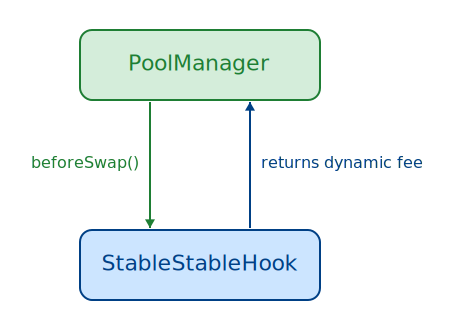
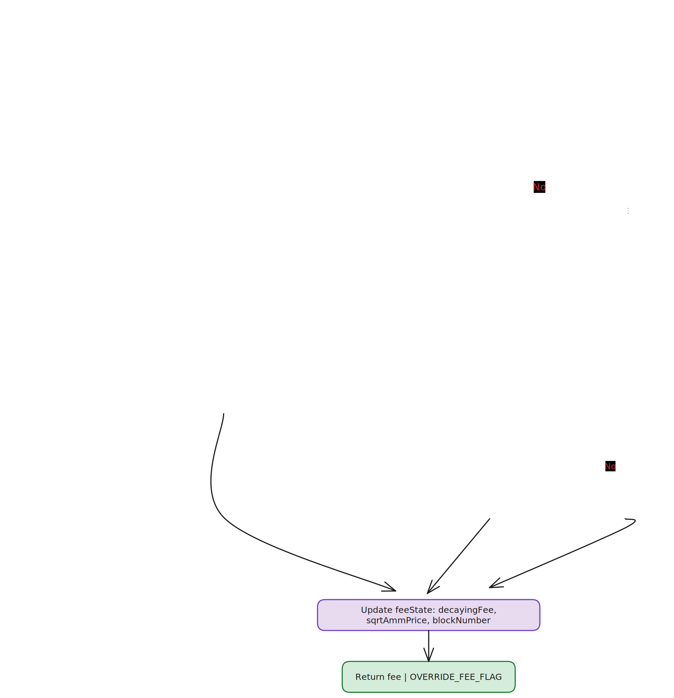
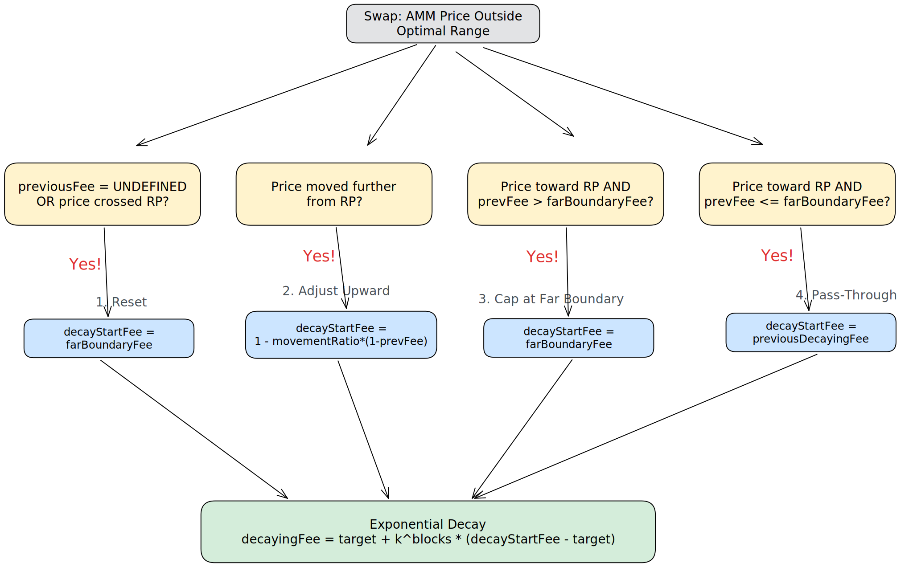

# StableStableHook

Technical specification for a dynamic fee hook targeting stable/stable pools on Uniswap v4.

## Table of Contents

- [Overview](#overview)
- [Architecture](#architecture)
- [Configuration](#configuration)
  - [FeeConfig](#feeconfig-per-pool)
  - [FeeState](#feestate-per-pool-updated-every-swap)
  - [Validation Rules](#validation-rules)
  - [Access Control](#access-control)
- [The Optimal Range](#the-optimal-range)
  - [Definition](#definition)
  - [Price Ratio](#price-ratio)
  - [Close Boundary Fee](#close-boundary-fee)
  - [Far Boundary Fee](#far-boundary-fee)
- [beforeSwap Algorithm](#beforeswap-algorithm)
  - [Inside Optimal Range](#inside-optimal-range)
  - [Outside Optimal Range](#outside-optimal-range)
- [Decay Mechanism](#decay-mechanism)
  - [Phase 1: Fee Adjustment](#phase-1-fee-adjustment-state-machine)
  - [Phase 2: Exponential Decay](#phase-2-exponential-decay)
- [Invariants](#invariants)

---

## Overview

`StableStableHook` implements a dynamic fee mechanism for Uniswap v4 pools containing two stable assets (e.g., USDC/USDT). The hook overrides the LP fee on every swap via `beforeSwap`, computing a fee based on how far the current AMM price has drifted from a configured reference price.

### Design Goals

1. **Consistent effective prices.** Inside a tight band around the reference price, all buys execute at one effective price and all sells at another, regardless of the AMM spot price.

2. **Mean-reversion incentives.** Outside that band, fees decay over time to attract arbitrageurs who push the price back toward the reference.

3. **Zero fee for adverse movement.** Swaps that push the price further from the reference pay no fee. These swaps provide volume without extracting value from the mispricing, so penalizing them would reduce activity without benefiting LPs.

---

## Architecture



`PoolManager` calls `beforeSwap` on every swap. The hook reads the current AMM price, computes the price ratio relative to the reference, and returns a dynamic fee override.

---

## Configuration

Each pool maintains two data structures: **FeeConfig** (economic parameters, set at pool creation) and **FeeState** (mutable state, updated on every swap).

### FeeConfig (per pool)

| Field                   | Type      | Description                                                                                                                    |
| ----------------------- | --------- | ------------------------------------------------------------------------------------------------------------------------------ |
| `k`                     | `uint24`  | Per-block decay factor in Q24 format. Example: `16,609,443` ≈ 0.99, meaning the fee retains 99% of its value each block.       |
| `logK`                  | `uint24`  | Precomputed `-ln(k) >> 40`. Used for efficient exponentiation when `blocksPassed > 4`.                                         |
| `optimalFeeE6`          | `uint24`  | Fee rate defining the optimal range width in **price space** at 1e6 precision. Example: `90` = 0.009%. Maximum: `10,000` (1%). |
| `referenceSqrtPriceX96` | `uint160` | Reference center price in sqrt Q96 format — the "true" exchange rate of the stable pair.                                       |

### FeeState (per pool, updated every swap)

| Field             | Type      | Description                                                                                                             |
| ----------------- | --------- | ----------------------------------------------------------------------------------------------------------------------- |
| `decayingFeeE12`  | `uint40`  | Last decaying fee at 1e12 precision, or `UNDEFINED_DECAYING_FEE_E12` if the previous swap was inside the optimal range. |
| `sqrtAmmPriceX96` | `uint160` | AMM sqrt price at the last swap. Used to determine price movement direction.                                            |
| `blockNumber`     | `uint40`  | Block number when the fee was last updated. Drives time-based decay.                                                    |

### Validation Rules

**`k` and `logK`**: Both must be nonzero. `logK` must satisfy `logK == uint256(-lnWad(k_as_wad)) >> 40` exactly. This prevents two failure modes: `k = 0` would cause instant decay and division-by-zero risk; `logK = 0` would disable decay entirely, making the fee static.

**`optimalFeeE6`**: Must satisfy `optimalFeeE6 <= MAX_OPTIMAL_FEE_E6` (10,000 = 1%).

**`referenceSqrtPriceX96`**: Must be bounded such that the full optimal range stays within Uniswap v4's valid sqrt price range `[MIN_SQRT_PRICE, MAX_SQRT_PRICE)`. Since the optimal range is defined in price space, the sqrt price bounds use `sqrt(1 - fee)`:

```
referenceSqrtPriceX96 * sqrt(1 - maxOptimalFee) >= MIN_SQRT_PRICE
referenceSqrtPriceX96 / sqrt(1 - maxOptimalFee)  < MAX_SQRT_PRICE
```

### Access Control

| Role            | Permissions                                                                                                                         |
| --------------- | ----------------------------------------------------------------------------------------------------------------------------------- |
| `owner`         | Can call `initializePool()` to create new pools.                                                                                    |
| `configManager` | Can call `updateFeeConfig()` and `setConfigManager()`. Setting `configManager` to `address(0)` permanently disables config updates. |

The `_beforeInitialize` hook reverts unless `msg.sender` is the hook itself. Since a hook cannot call itself externally, pools can only be created through `initializePool()`, which calls `PoolManager.initialize()` internally. This guarantees the fee config is set atomically with pool creation — no pool can exist without a valid config.

---

## The Optimal Range

### Definition

The optimal range is a price band around the reference price, defined in **price space** (not sqrt price space):

```
lowerBound = RP × (1 - optimalFee)
upperBound = RP / (1 - optimalFee)
```

where `RP` is the reference price (i.e., `referenceSqrtPriceX96²` expressed as a ratio).

The asymmetry is intentional. Multiplying by `(1 - f)` on the lower side and dividing by `(1 - f)` on the upper side ensures that a buy-then-sell roundtrip at the boundaries costs the same percentage in both directions.

### Price Ratio

To unify the math across "price above RP" and "price below RP", the system computes a **normalized price ratio** that is always `≤ 1`:

```
priceRatio = min(ammPrice, RP) / max(ammPrice, RP)
```

This collapses symmetric cases into a single formula throughout the fee logic.

### Close Boundary Fee

The close boundary fee measures how far the AMM price sits from the **nearer** edge of the optimal range. Its sign is the primary branching condition in `beforeSwap`: it determines whether the current price is inside or outside the range.

Derived by setting the effective price (after fee) equal to the close boundary. Both the `ammPrice < RP` and `ammPrice > RP` cases collapse via the normalized `priceRatio` into:

```
closeBoundaryFeeE12 = 1 - priceRatio / (1 - optimalFee)
```

**Sign convention:**

- `closeBoundaryFeeE12 ≤ 0` → AMM price is **inside** the optimal range
- `closeBoundaryFeeE12 > 0` → AMM price is **outside** the optimal range

### Far Boundary Fee

The far boundary fee measures how far the AMM price sits from the **farther** edge of the optimal range. It is only relevant when the price is outside the optimal range, where it serves as the upper bound for the decaying fee and contributes to the target fee calculation.

Same derivation approach — set the effective price equal to the far boundary:

```
farBoundaryFeeE12 = 1 - (1 - optimalFee) × priceRatio
```

**Key property:** `farBoundaryFee ≥ closeBoundaryFee` whenever the price is outside the optimal range.

---

## beforeSwap Algorithm



`beforeSwap` is the entry point for all fee logic. It reads the current AMM price, computes the price ratio relative to the reference, derives the close boundary fee, and branches accordingly.

### Inside Optimal Range

When `closeBoundaryFeeE12 ≤ 0`, the AMM price is within the optimal range. The hook enforces **consistent effective prices** for all swappers regardless of where the spot price sits within the band:

- All sells execute at effective price = `RP × (1 - optimalFee)` (lower bound)
- All buys execute at effective price = `RP / (1 - optimalFee)` (upper bound)

The fee formula depends on swap direction relative to the price's position. The branching condition is `ammPriceBelowRP == userSellsZeroForOne`:

**Swap toward the closer boundary** (condition is `true`):

```
fee = 1 - (1 - optimalFee) / priceRatio
```

**Swap toward the farther boundary** (condition is `false`):

```
fee = 1 - (1 - optimalFee) × priceRatio
```

These formulas mirror the close and far boundary fee derivations — same approach of setting the effective price equal to the target boundary and solving for the fee. At the reference price (`priceRatio = 1`), both produce exactly `optimalFee`. As the price drifts toward one boundary, the fee for swaps pushing toward it decreases (approaching 0), while the fee for swaps pushing away increases (approaching ≈ `2 × optimalFee`).

### Outside Optimal Range

When `closeBoundaryFeeE12 > 0`, the fee system switches regime.

#### Direction-Based Zero Fee

Swaps that push the price **further from the reference** pay zero fee:

```solidity
lpFeeE12 = (ammPriceBelowRP == userSellsZeroForOne) ? 0 : decayingFeeE12;
```

The condition `ammPriceBelowRP == userSellsZeroForOne` is `true` when the swap worsens the mispricing — either price is below RP and the user sells token0 (pushing it further down), or price is above RP and the user buys token0 (pushing it further up). Penalizing these swaps would reduce volume without helping LPs. Fees are only charged on swaps pushing price **back toward** the reference, since those swappers benefit from buying a temporarily underpriced asset.

#### Target Fee

The target fee is the asymptotic destination for the decaying fee:

```
targetFee = farBoundaryFee - closeBoundaryFee / 2
```

The further the price drifts outside the range (larger `closeBoundaryFee`), the more the target drops below `farBoundaryFee`. This creates progressively stronger incentive for mean-reversion: the longer the price remains outside the range, the cheaper it becomes for arbitrageurs to push it back.

**Properties:** `targetFee > 0` and `targetFee ≤ farBoundaryFee` when outside the optimal range. The gap between `targetFee` and `farBoundaryFee` is always exactly `closeBoundaryFee / 2`.

#### Decaying Fee

The fee charged to swaps pushing price toward RP is a **decaying fee** that starts high and exponentially converges toward the target fee. The fee resets to `farBoundaryFee` when the price first leaves the optimal range, decays between swaps based on elapsed blocks, and is adjusted for price movement. The full algorithm is described in the next section.

---

## Decay Mechanism

The decay mechanism operates in two phases: (1) adjust the previous fee based on price movement since the last swap, then (2) apply exponential decay toward the target fee.

### Phase 1: Fee Adjustment (State Machine)



The previous swap's state determines which of four adjustment paths applies before exponential decay.

#### Case 1: Reset

**Condition:** `previousDecayingFeeE12 == UNDEFINED` (previous swap was inside the optimal range), or the price crossed the reference price since the last swap (was above RP, now below, or vice versa).

**Action:** `decayStartFee = farBoundaryFee`

**Rationale:** No meaningful previous fee exists to adjust from. Starting at the far boundary is the conservative choice — it represents the maximum economically coherent fee.

#### Case 2: Upward Adjustment

**Condition:** Price moved **further** from the reference (still on the same side of RP, but more extreme).

**Action:** Adjust the previous fee to preserve the same effective price at the new (worse) AMM price.

**Derivation:** The adjusted fee preserves the same effective price the previous swap produced, despite the worsened AMM price. Setting effective prices equal and solving:

```
decayStartFee = 1 - priceMovementRatio × (1 - previousDecayingFee)
```

where priceMovementRatio = min(ammPrice_new, ammPrice_prev) / max(ammPrice_new, ammPrice_prev), always ≤ 1. Since priceMovementRatio < 1 when price worsens, this guarantees decayStartFee ≥ previousDecayingFee.

#### Case 3: Cap at Far Boundary

**Condition:** Price moved **toward** the reference, but the previous fee exceeds the new `farBoundaryFee`.

**Action:** `decayStartFee = farBoundaryFee`

**Rationale:** As the price improves (moves toward RP), `farBoundaryFee` decreases. The fee should never exceed what the far boundary would produce at the current price.

#### Case 4: Pass-Through

**Condition:** Price moved toward the reference, and `previousDecayingFee ≤ farBoundaryFee`.

**Action:** `decayStartFee = previousDecayingFee` (no adjustment).

**Rationale:** The previous fee remains within valid bounds. Exponential decay handles the reduction from here.

### Phase 2: Exponential Decay

After adjustment, the fee decays exponentially toward the target:

```
decayingFee = targetFee + k^blocksPassed × (decayStartFee - targetFee)
```

where `k < 1` (e.g., 0.99) is the per-block retention factor. As `blocksPassed` increases, `k^blocksPassed → 0`, so `decayingFee → targetFee`.

**Implementation:** `k^blocksPassed` is computed via direct multiplication (`fastPow`) for 1–4 blocks, or `exp(-logK × n)` using Solady's `expWad` for 5+ blocks. Both paths are mathematically equivalent: `k^n = exp(-n × (-ln(k)))`.

---

## Invariants

The following properties hold for all valid inputs (any valid price, swap direction, and block gap):

| #   | Invariant                                                              | Description                                                                                                                                                     |
| --- | ---------------------------------------------------------------------- | --------------------------------------------------------------------------------------------------------------------------------------------------------------- |
| 1   | `lpFeeE12 ≤ ONE_E12`                                                   | Fee never exceeds 100%.                                                                                                                                         |
| 2   | `targetFee ≤ decayingFee ≤ decayStartFee`                              | Decay is monotonically bounded between the target and the starting fee.                                                                                         |
| 3   | Consistent effective prices                                            | Inside the optimal range, effective buy price = `RP / (1 - optimalFee)` and effective sell price = `RP × (1 - optimalFee)` for all AMM prices within the range. |
| 4   | No revert                                                              | `beforeSwap` never reverts.                                                                                                                                     |
| 5   | Equal start and target → no decay                                      | If `decayStartFeeE12 == targetFeeE12`, then `decayingFeeE12 == targetFeeE12`, regardless of `k` or `blocksPassed`                                               |
| 6   | `decayStartFee ≥ previousDecayingFeeE12` (price moves further from RP) | Price worsening can only increase the fee.                                                                                                                      |
